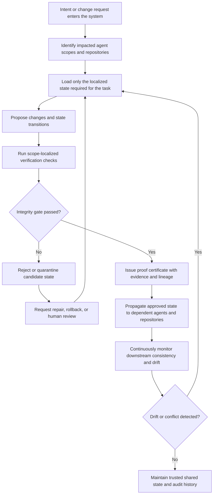

# ATULYA

ATULYA stands for an algorithm that utilises, learns, yields, and adapts.

It is built to bring the beauty of algorithms and maths back into everyday life and work, in a way that feels simple, useful, and human.

## Integrity-Gated State Maintenance

The flow below summarizes **Integrity-Gated State Maintenance for Autonomous Agents and Distributed Multi-Repository Systems Using Scope-Localized Verification and Proof Certificates**.

This pattern is designed for environments where correctness, traceability, and controlled propagation matter as much as raw autonomy.

## Open Patent

ATULYA believes in an idea called **open patent**.

Think of it like open source, but for inventions, methods, and standards.

The goal is simple:
- keep important ideas open to humanity
- protect the spirit of the work from being locked away or misused
- create shared standards for the AI and human world
- make good systems easier for everyone to build on

In plain words, open patent means:

> build in public, protect with purpose, and keep the door open for the future.

This is not about making things complicated.
This is about making sure the foundations of human and AI systems stay fair, understandable, and useful for everyone.

## A Human Idea for an AI Age

ATULYA is part of a bigger shift toward tools that can learn over time, remember context, support better decisions, and help turn intent into action.

The vision is to create systems that help people think clearly, work better, and stay aligned with what matters.

Not just for one company.
Not just for one country.
For people everywhere — worldwide, and one day, interplanetary.

Simple for users. Built for the future.
