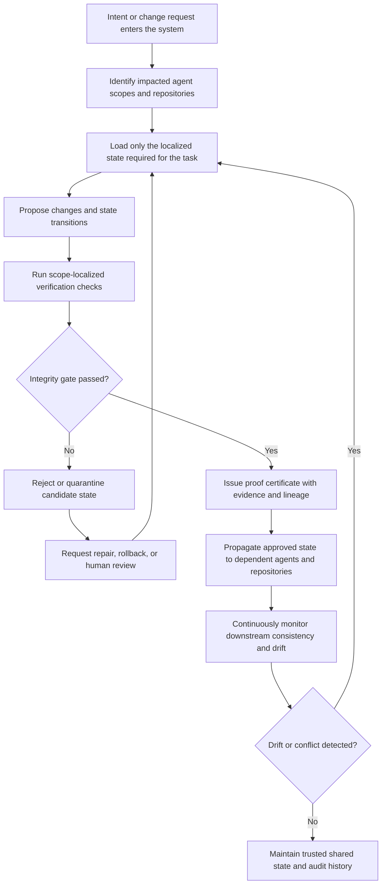

  

# ATULYA

## Simple for users. Built for the future.

ATULYA stands for an algorithm that utilises, learns, yields, and adapts.

ATULYA is a protocol and systems design direction for trustworthy autonomous systems operating across distributed repositories. It is built to bring the beauty of algorithms and mathematics back into everyday life and work in a way that feels simple, useful, and human.

  
  
  

| What ATULYA is | Why it matters |
| --- | --- |
| A framework for stateful, verifiable, multi-repository autonomous systems. | It prioritises correctness, traceability, and controlled propagation instead of unchecked autonomy. |
| A design language for agent coordination, record models, and proof-backed state transitions. | It gives teams a way to scale intelligence without losing trust, reviewability, or human oversight. |

| Read path | Use it for |
| --- | --- |
| [`docs/README.md`](docs/README.md) | Navigate the repository and find the right entry point. |
| [`docs/protocol/README.md`](docs/protocol/README.md) | Understand the protocol in the intended reading order. |
| [`docs/protocol/design-direction.md`](docs/protocol/design-direction.md) | See the architectural direction and adoption strategy. |
| [`docs/protocol/record-model.md`](docs/protocol/record-model.md) | Review canonical record types, families, and state structure. |
| [`docs/architecture/knowledge-compression-loop.md`](docs/architecture/knowledge-compression-loop.md) | Explore the AI knowledge-compression loop and MVP roadmap. |

---

## Read This Repository In One Pass

This README is the front door.
The protocol itself lives in structured docs so future commits stay easy to place, review, and extend.

### Start Here

- [`docs/README.md`](docs/README.md) for the documentation map.
- [`docs/protocol/README.md`](docs/protocol/README.md) for protocol reading order.
- [`docs/protocol/design-direction.md`](docs/protocol/design-direction.md) for architectural direction and adoption strategy.
- [`docs/protocol/record-model.md`](docs/protocol/record-model.md) for canonical record types and families.
- [`docs/architecture/knowledge-compression-loop.md`](docs/architecture/knowledge-compression-loop.md) for the AI knowledge-compression loop and MVP direction.

## Integrity-Gated State Maintenance

The flow below summarizes **Integrity-Gated State Maintenance for Autonomous Agents and Distributed Multi-Repository Systems Using Scope-Localized Verification and Proof Certificates**.

This pattern is designed for environments where correctness, traceability, and controlled propagation matter as much as raw autonomy.

## Open Patent

ATULYA believes in an idea called **open patent**.

Think of it like open source, but for inventions, methods, and standards.

The goal is simple:
- keep important ideas open to humanity
- protect the spirit of the work from being locked away or misused
- create shared standards for the AI and human world
- make good systems easier for everyone to build on

In plain words, open patent means:

> build in public, protect with purpose, and keep the door open for the future.

This is not about making things complicated.
This is about making sure the foundations of human and AI systems stay fair, understandable, and useful for everyone.

## A Human Idea for an AI Age

ATULYA is part of a bigger shift toward tools that can learn over time, remember context, support better decisions, and help turn intent into action.

The vision is to create systems that help people think clearly, work better, and stay aligned with what matters.

Not just for one company.
Not just for one country.
For people everywhere — worldwide, and one day, interplanetary.

Simple for users. Built for the future.
