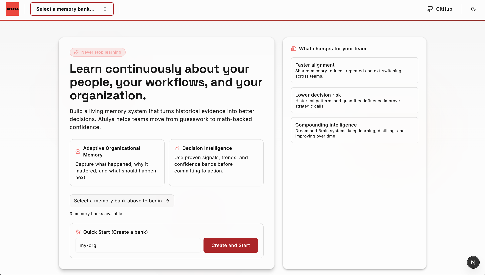

# Atulya

[Read the evolved BRAIN work](https://github.com/eight-atulya/atulya/blob/2c1fe0047c534cbd081cac308ba0fad8dafd77e4/atulya-brain/patent/BRAIN_Patent_Draft.md)

**A living algorithm for machine intelligence (MI).**

Atulya is built on one simple idea:  
>machines should not only store information, they should learn and grow over time.

Most systems try to remove all mistakes. Atulya takes a different path.  
It treats gaps, change, and feedback as useful signals for learning.

## See it in action

  

  <em>Learn continuously from team history, reduce decision risk, and compound intelligence over time.</em>

<table align="center">
  <tr>
    <td align="center"><strong>Continuous learning</strong></td>
    <td align="center"><strong>Lower decision risk</strong></td>
    <td align="center"><strong>Compounding intelligence</strong></td>
  </tr>
  <tr>
    <td align="center">Turn historical evidence into better next actions.</td>
    <td align="center">Use real signals, not gut feel alone.</td>
    <td align="center">Keep improving with every recall and reflect cycle.</td>
  </tr>
</table>

  <strong>Start with one memory bank, run your first workflow, and build from there.</strong>

## What Atulya does

- Helps machines remember important things over time
- Improves responses using past context
- Learns from new inputs instead of starting from zero
- Supports sharing distilled memory between systems through `.brain` files

## Why this matters

People do not grow by being perfect.  
People grow by observing, adjusting, and moving forward.

Atulya applies this same principle to machine intelligence:  
keep learning, keep adapting, and keep improving.

## Vision

Atulya is designed as a long-term foundation for machine intelligence that is:

- useful in real-world systems
- understandable by humans
- collaborative instead of isolated
- always learning

The goal is not just smarter software.  
The goal is a better machine partner for human decisions.
