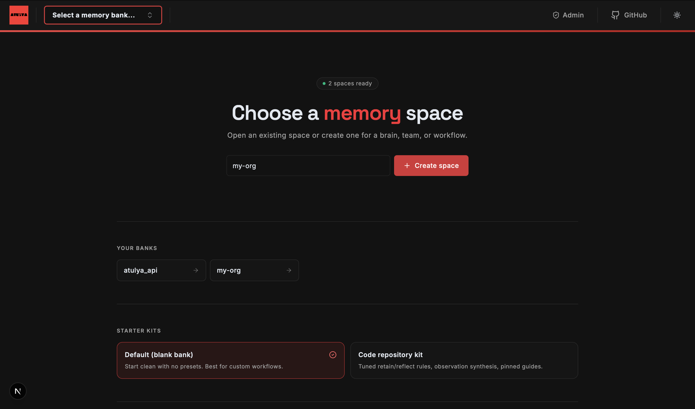
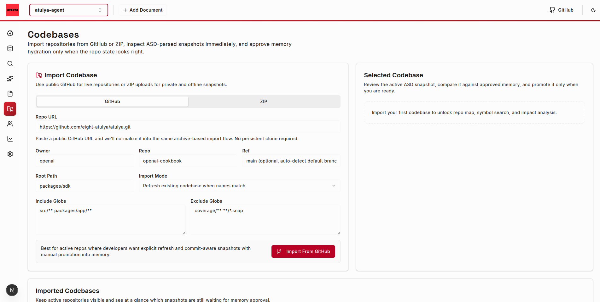
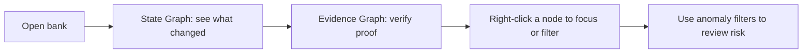

# Atulya

[Read the evolved BRAIN work](https://github.com/eight-atulya/atulya/blob/2c1fe0047c534cbd081cac308ba0fad8dafd77e4/atulya-brain/patent/BRAIN_Patent_Draft.md)

[Read the Atulya product principles](./ATULYA_PRINCIPLES.md)

For builders: [one-time setup](./scripts/dev/SETUP.md).

Atulya is the memory and reasoning layer for organizations and AI agents.
It is a brain built on the strongest foundation intelligence can have: memory.
Atulya stands for **Algorithm That Understands, Learns, Yields, & Adapts**.

Like human intelligence, Atulya starts by remembering, connecting, and learning from experience over time.
It helps teams keep context, explain decisions, and compound intelligence instead of losing it between people, tools, and workflows.

Built for teams where lost context is expensive, especially small teams where every missed insight costs speed, focus, or revenue.

## Your organization is hemorrhaging intelligence. Every day.

- Someone leaves. Their context goes with them.
- A decision gets made. Nobody remembers why.
- An agent solves a problem. The next agent starts from zero.
- A new engineer joins. Six months to get up to speed. Again.

This is not a people problem. It is an infrastructure problem.

Most companies have systems for chat, tickets, code, and documents. Very few have a system for durable organizational understanding.

Atulya fills that gap.

## Why teams adopt Atulya

- Preserve decision context, not just final outputs.
- Give AI agents memory that compounds instead of resetting every run.
- Reduce onboarding drag by making important history legible.
- Lower execution risk with evidence-backed recall, reflect, graph, and entity intelligence.

## Why startups care

For a startup, Atulya can become the organization's brain.

- Save the context behind customer calls, product decisions, incidents, and experiments before it disappears.
- Protect the team from key-person risk when one founder, engineer, or operator carries too much in their head.
- Help every new hire and every new agent become useful faster.
- Turn hard-won lessons into reusable advantage for future deals, product bets, hiring, and execution.
- Create more surface area for opportunity by making what the team already knows searchable, explainable, and usable.

Small teams rarely lose because they lack effort. They lose because the learning does not stay alive long enough to compound.

Atulya helps that learning stay alive.

## What Atulya is

Atulya is a living intelligence layer for teams, built on memory first:

- **Memory banks** that retain what matters and compress what repeats
- **Versioned memory repos** with branches, snapshots, rollback, branch-aware reads, and safe forks into brand-new banks
- **Recall and reflect** flows that retrieve evidence and reason over it
- **Code intelligence** that turns large repos into ranked symbols, module briefs, and curated memory
- **Entity and graph intelligence** that show who matters, what changed, and where risk is building
- **Internet research** that keeps live-web investigation separate from durable memory until reviewed

If you only read one extra file in this repository, read [ATULYA_PRINCIPLES.md](./ATULYA_PRINCIPLES.md).

## See it in action

  

  <em>Learn continuously from team history, reduce decision risk, and compound intelligence over time.</em>

  

  <em>Code-intel turns 50k+ raw chunks into ranked symbols, module briefs, and intent-driven curation ~ so reviewers act on what actually matters.</em>

<table align="center">
  <tr>
    <td align="center"><strong>Continuous learning</strong></td>
    <td align="center"><strong>Lower decision risk</strong></td>
    <td align="center"><strong>Compounding intelligence</strong></td>
  </tr>
  <tr>
    <td align="center">Turn historical evidence into better next actions.</td>
    <td align="center">Use real signals, not gut feel alone.</td>
    <td align="center">Keep improving with every recall and reflect cycle.</td>
  </tr>
</table>

  <strong>Start with one memory bank, run your first workflow, and build from there.</strong>

## What teams get

- Durable memory instead of fragmented context
- Safe experimentation with branchable banks and rollback-ready snapshots
- Better answers backed by retained evidence
- Faster onboarding for engineers, operators, and agents
- Reusable knowledge that can move between systems through `.brain` files
- A bank-level plain-language map of people, tools, companies, projects, concepts, and how they connect

## Entity Intelligence

Entity intelligence turns a bank's entity graph into a readable "digital person" map.
During retain, entities can carry root classification metadata such as person, tool,
organization, project, event, concept, confidence, evidence, and role hints. The bank-level
worker then combines those typed entities, co-occurrence links, trajectory states, and
forecasts into a markdown intelligence document with stable delta updates.

Use it when you want to understand what a bank knows at scale: the important people,
the tools and companies around them, the projects and themes that repeat, and the
relationships or unknowns worth investigating next.

## Graph Review

The Control Plane has a graph workspace that helps you review memory without getting lost in a large node map.

| View | Best for | What you get |
|---|---|---|
| State Graph | Quick understanding | What changed, what is stale, what conflicts |
| Evidence Graph | Proof review | Raw memories and links behind a state |
| Analyst query | Fast investigation | A short answer plus focused graph area |

| Control | What it does |
|---|---|
| Right-click node | Open quick actions like focus neighbors or filter |
| Filter Anomalies | Show only nodes linked to anomaly events |
| Severity Overlay | Color nodes by anomaly severity |
| Link filters | Show/hide semantic, temporal, entity, and causal links |
