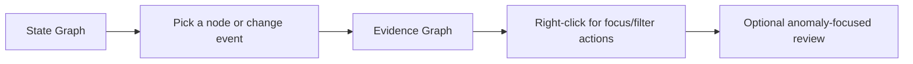

# Graph feature module for the control plane

This module powers the graph experience in the Control Plane.

It is designed for one simple user flow:

1. Understand what changed.
2. Open proof.
3. Focus only the part of the graph you care about.

## Folder structure

| Path | Purpose |
|---|---|
| `components/` | State and evidence graph UI |
| `components/graph-workbench.tsx` | Shared graph shell, layout state, fullscreen, context menu hooks |
| `components/state-graph.tsx` | Meaning-first graph (state and changes) |
| `components/graph-2d.tsx` | Evidence graph (raw memories and links) |
| `layout/` | Deterministic layout helpers and worker entrypoints |

## Production UX behavior

| Capability | Where it is handled | Notes |
|---|---|---|
| Right-click node actions | `graph-workbench.tsx` + parent views | Works for both overview and detail modes |
| Link meaning (semantic/temporal/entity/causal) | `graph-2d.tsx` + `graph-workbench.tsx` | Causal subtypes are preserved (`causes`, `caused_by`, `enables`, `prevents`) |
| Anomaly-focused evidence review | `data-view.tsx` (parent) | Supports anomaly filtering and severity overlay |
| Stable large-bank rendering | `graph-workbench.tsx` + summary/focus-area APIs | Uses overview/compact/detail modes to avoid clutter |

## Developer rules

| Rule | Why |
|---|---|
| Keep shared, app-wide UI in `src/components/` | Avoid graph module becoming a generic UI dump |
| Keep graph-specific logic in this feature module | Easier ownership and safer changes |
| Add new graph infra here, not in root component folders | Keeps data flow and layout logic consistent |
| Prefer small, composable props over implicit globals | Makes graph behavior easier to test and reason about |
