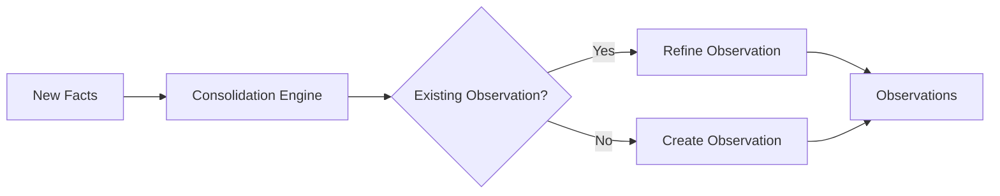
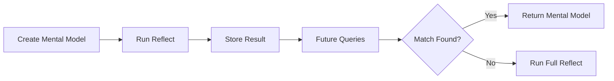

Atulya learns at two levels: **observations** (automatic synthesis from facts) and **mental models** (curated summaries you control). During `reflect`, the agent checks mental models first, then observations, then raw facts.

<!-- truncate -->

## Two levels of learning

| Level | What it is | How it is created |
|-------|------------|-------------------|
| **Mental models** | Curated summaries for common queries | API / control plane |
| **Observations** | Consolidated knowledge from facts | Background job after `retain` |

Priority at reflect time: mental models → observations → facts.

---

## Observations: automatic consolidation

### What they are

Observations are **consolidated knowledge** synthesized from multiple facts. Raw facts are point-in-time; observations are patterns that emerge from evidence.

| Raw facts | Observation |
|-----------|-------------|
| "Alice prefers Python" | "Alice is a Python-focused developer who values readability, recommends type hints, and prefers pytest" |
| "Alice dislikes verbose code" | |
| "Alice recommends type hints" | |

Older systems often split entity summaries and belief-style "opinions" into separate paths. Observations unify that into one consolidation surface with evidence links and history.

### Background consolidation

After `retain()`, consolidation runs automatically:

1. Analyze new facts against existing knowledge
2. Detect patterns across related information
3. Synthesize or refine observations
4. Link each observation to supporting facts



### Evidence-based evolution

Observations update when new evidence arrives. The text can capture the **journey**, not only the latest state:

| Time | Fact | Observation |
|------|------|-------------|
| Week 1 | "User loves React" | "User prefers React for frontend" |
| Week 2 | "User praises React's component model" | "User is enthusiastic about React, especially components" |
| Week 3 | "User switched to Vue" | "User was a React enthusiast but has moved to Vue" |

The agent knows the switch was deliberate, not ignorance of React.

### Mission-oriented consolidation

Bank **mission** steers what gets synthesized:

```python
client.create_bank(
    bank_id="support-agent",
    mission="You're a customer support agent - track customer preferences, "
            "past issues, and communication styles.",
)
```

With a mission, consolidation favors customer-relevant observations. Without one, consolidation is general-purpose.

### Recalling observations

```python
response = client.recall(
    bank_id="my-bank",
    query="What do we know about Python preferences?",
    types=["observation"],
)
```

Observations expose supporting facts, last updated time, and change history instead of a single opaque confidence score.

---

## Mental models: curated knowledge

Mental models are **saved reflect responses** for questions you care about. Create one with a `source_query`; Atulya runs reflect once and stores the result. Future reflect calls check models before doing full reasoning.



| Benefit | Why |
|---------|-----|
| Consistency | Same framing for recurring questions |
| Speed | Pre-computed content, optional direct lookup by ID |
| Quality | Human-reviewed summaries |
| Control | You define the source query and refresh policy |

### Direct lookup (no LLM)

```python
mental_model = client.get_mental_model(
    bank_id="my-bank",
    mental_model_id="team-communication",
)
print(mental_model.content)
```

### Create and auto-refresh

```python
client.create_mental_model(
    bank_id="my-bank",
    name="Team Communication Preferences",
    source_query="How does the team prefer to communicate?",
    tags=["team"],
)

client.create_mental_model(
    bank_id="my-bank",
    name="Project Status",
    source_query="What is the current project status?",
    trigger={"refresh_after_consolidation": True},
)
```

---

## Directives: hard guardrails

**Directives** are absolute rules during reflect (unlike disposition traits, which only influence style):

- "Never provide medical diagnoses"
- "Always respond in formal English"
- "Never share PII"
- "Always cite sources for factual claims"

They are injected into reflect prompts and appear in `based_on`. See [Directives](../developer/api/memory-banks#directives).

---

## Agentic reflect

`reflect` is agentic: it iteratively recalls memories and consults mental models and observations before answering. Better for multi-hop questions; slower than raw `recall`. Use `recall` when you only need retrieval latency.

---

## Resources

- [Recall API](../developer/api/recall)
- [Reflect API](../developer/api/reflect)
- [Mental Models API](../developer/api/mental-models)
- [Observations guide](../developer/observations)
- [Changelog](../changelog)
