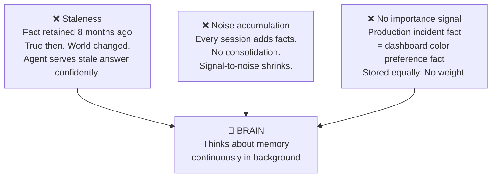
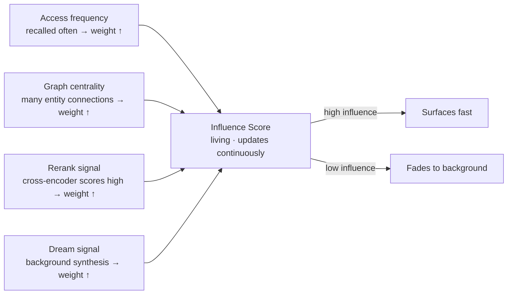
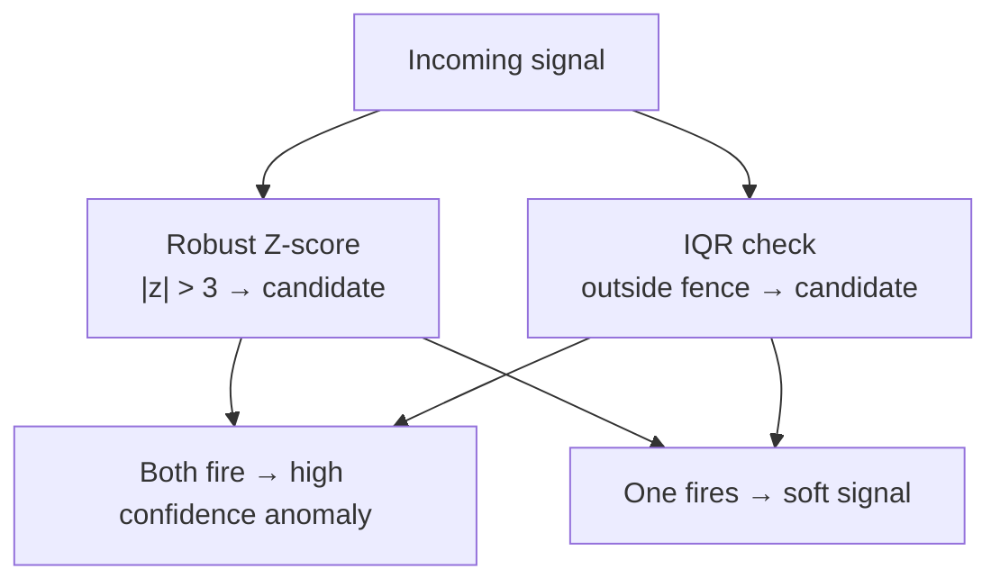
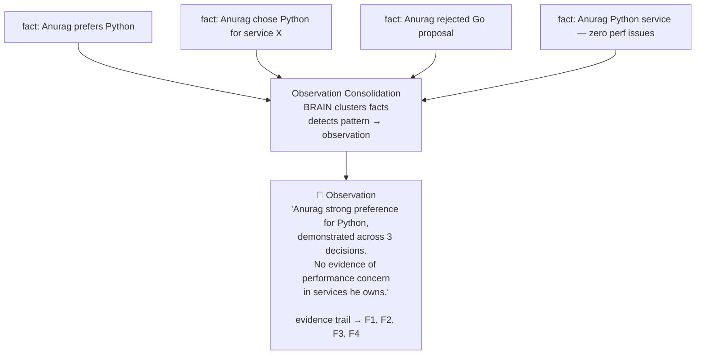
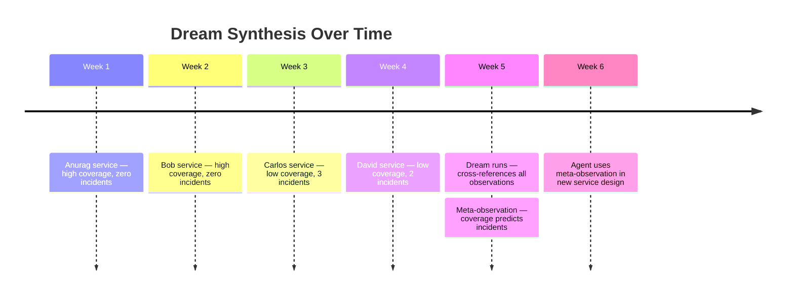
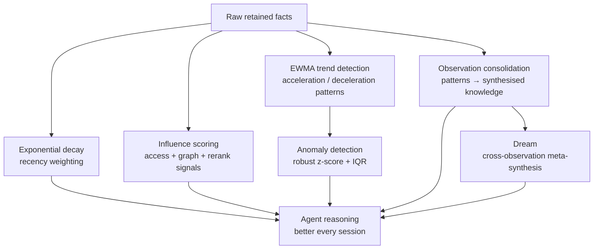

# BRAIN in Atulya: The ML Layer That Never Stops Learning

Storing memory easy. Pile of facts. Searchable. Done.

But pile of facts is not intelligence. Intelligence is knowing what matters in the pile. What is hot right now. What is fading. What just spiked abnormally. What contradicts something believed six months ago.

That is BRAIN. Layer inside Atulya that thinks about what got retained — continuously, in background, without waiting to be asked.

<!-- truncate -->

---

## Three Problems Retrieval Alone Cannot Solve



BRAIN solves all three without anyone manually curating the memory bank.

---

## Layer 1: Exponential Decay — What Fades Should Fade

Every retained fact gets temporal weight. Recent = high weight. Old = low weight unless reinforced.

```
w(t) = w₀ · e^(−λt)
```

| `λ` setting | Used for | Effect |
|---|---|---|
| High decay rate | Live incidents, product decisions | Stale facts fade fast |
| Low decay rate | Architectural decisions, org principles | Facts persist unless explicitly contradicted |
| Zero decay | Mental models, hard constraints | Never auto-fade |

Recency weight blended into retrieval ranking. Stale fact still retrievable — but ranked lower. Recent relevant evidence surfaces naturally.

---

## Layer 2: Influence Scoring — What Matters Should Rise

Not all facts equal. Some are load-bearing.



Memory that matters floats. Memory that doesn't — fades. Agent querying high-influence memories get faster path to load-bearing knowledge.

---

## Layer 3: EWMA Trend Detection — Is This Accelerating?

Exponential Weighted Moving Average on access patterns. Not just "was this accessed?" — "is access rate changing?"

| Pattern detected | Possible meaning | BRAIN action |
|---|---|---|
| Topic: 2×/week for months → 8×/day suddenly | Production incident unfolding | Spike flagged — surface to operator |
| Topic: steadily declining for 6 weeks | Project winding down / stale area | Flag as candidate for archival review |
| New entity appearing across 8 systems | New team member onboarding fast | Normal — no flag |
| Unknown external domain suddenly referenced 40× | Possible data contamination | Anomaly — flag for human review |

BRAIN acts like analyst watching the memory bank — not just storage clerk filing and retrieving.

---

## Layer 4: Robust Z-Score + IQR Anomaly Detection

Statistical anomaly detection on memory access and fact arrival patterns.

```
z = (x − median(x)) / MAD
```

Robust z-score uses **median** not mean, **MAD** (median absolute deviation) not σ. Handles heavy-tailed distributions in real usage data.

Also IQR: values outside `[Q1 − 1.5·IQR, Q3 + 1.5·IQR]` flagged.



Not alarm system. Signal system. Surface unusual patterns for human or agent review.

---

## Layer 5: Observation Consolidation — Raw Facts → Knowledge

Individual facts from Anurag's retained memory:

> "Anurag prefers Python."  
> "Anurag chose Python for service X."  
> "Anurag pushed back on Go proposal in arch review."  
> "Anurag's Python service has no performance issues."

Four separate retrieval hits. Pattern obvious to human. Not to agent querying one at a time.



Observation has evidence trail — points back to source facts. Can be validated, challenged, updated. This is how human expert memory works. Not recall of every data point. Recall of synthesized understanding. BRAIN makes agent memory work same way.

---

## Layer 6: Dream — Background Synthesis Without Training

Dream is scheduled background process. Runs when bank quiet.



No single session generated that insight. Emerged from synthesis across many retained facts over weeks. No gradient updates. No retraining. Knowledge emerges from evidence. Safe. Reversible. Explainable.

---

## Why ML Without Training Loop Matters

| Approach | Cost | Reliability | Auditability | Catastrophic forgetting |
|---|---|---|---|---|
| Standard fine-tuning | GPU cluster · slow cycle | Brittle — may overwrite good knowledge | Black box | Yes — common failure |
| BRAIN synthesis | CPU · continuous · cheap | Additive — old observations preserved | Every observation inspectable | No — old knowledge never overwritten |

Operator can inspect what BRAIN learned. Read observations. See evidence. Disagree — delete or override specific observation. System transparent by design.

Memory bank is the model. Learning is writing new observations. No black box. No retrain cycle.

---

## The Full BRAIN Stack



Quiet. Continuous. Making agents smarter without anyone noticing until they suddenly have insights that should have taken weeks to develop manually.
