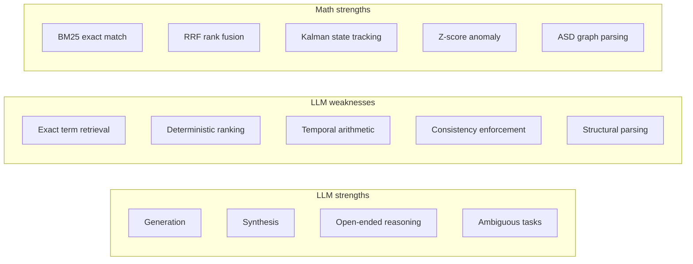
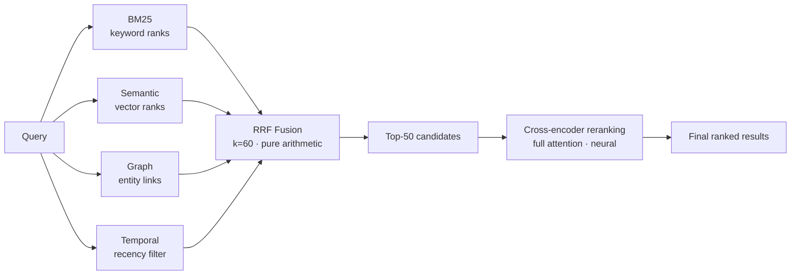
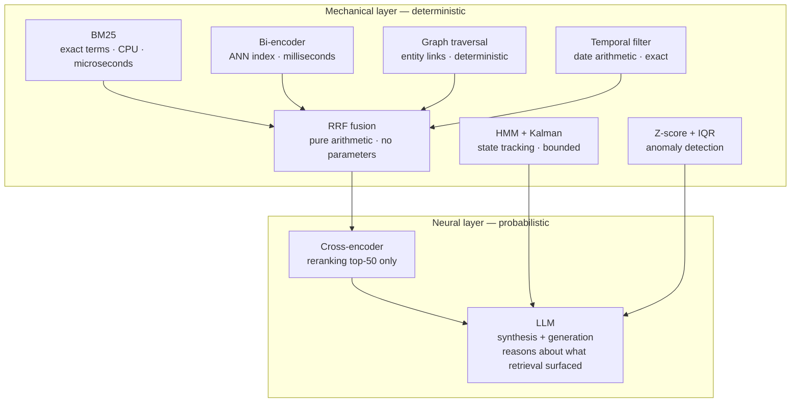

# Bring Back the Math: Why Future LLMs Need Mechanical Algorithms

LLM impressive. No argument.

LLM also hallucinate. Confidently. Fluently. Wrong answer look identical to right answer. No internal alarm. No "I am not sure." Just smooth wrong answer.

Why? LLM is distribution over tokens. Not truth machine. When distribution confident but wrong — output wrong, tone confident.

Math does not do this. `BM25(q, d)` returns score. Deterministic. Run again — same score. No drift. No confidence without basis.

Future of reliable AI: put math and LLMs in correct relationship. Not replace one with other. Each doing what it is designed for.

<!-- truncate -->

---

## Where LLMs Fail and Math Doesn't



Industry mistake: saw LLMs succeed at generation → assumed they succeed at everything. Replaced BM25 with semantic search. Replaced parsers with "just ask the LLM." Replaced deterministic pipelines with "agent will figure it out."

Result: systems that feel smarter but are less reliable. Fail in unpredictable ways.

---

## BM25: The Algorithm Nobody Wants to Talk About

Invented 1994. Still best-in-class for keyword retrieval.

```
BM25(q, d) = Σᵢ IDF(qᵢ) · (f(qᵢ,d) · (k₁+1)) / (f(qᵢ,d) + k₁·(1 − b + b·|d|/avgdl))
```

| Parameter | Meaning | Typical value |
|---|---|---|
| `f(qᵢ, d)` | Term frequency in document | — |
| `IDF(qᵢ)` | Rarity of term across corpus | `log((N-n+0.5)/(n+0.5))` |
| `k₁` | Term frequency saturation | 1.2 |
| `b` | Document length normalization | 0.75 |

**Why still relevant:**

| Query type | Semantic search | BM25 |
|---|---|---|
| "atulya.retain method" | Returns docs about storing, saving, persistence | Finds "atulya.retain" exactly — milliseconds |
| "error code ERR_AUTH_403" | Returns docs about auth failures — maybe | Finds "ERR_AUTH_403" exactly — always |
| "Anurag's PR from March 14" | Semantic match — unreliable | Keyword + date filter — precise |

BM25 and semantic search not competitors. Complementary. Different failure modes. Run both. Fuse results.

---

## Reciprocal Rank Fusion: Simple Math, Surprising Power

Run 4 retrieval methods in parallel. Each return ranked list. How to combine?

**Problem with averaging scores:** incompatible scales. Semantic similarity: 0.0–1.0. BM25: 0–50. Graph relevance: 0–∞. Cannot meaningfully average.

**RRF solution:**

```
RRF(d) = Σᵢ 1 / (k + rank(d, Lᵢ))
```



| Scenario | Single method | RRF |
|---|---|---|
| Query = exact error code | BM25 wins, semantic fails | BM25 rank 1 → high RRF |
| Query = "how does Anurag usually approach this?" | Semantic wins, BM25 fails | Semantic rank 1 → high RRF |
| Query = "what changed in auth last week?" | Temporal wins | Temporal + graph both contribute |
| Query = complex technical concept | All contribute | Stable fusion — no single method dominates |

RRF adds ~2ms. Meaningfully better than any single strategy. No learned weights. No parameters to tune. Pure math.

---

## Cross-Encoder: When Neural Networks Earn Their Place

Two-stage retrieval: recall first, precision second.

| Stage | Method | Scope | Speed | Quality |
|---|---|---|---|---|
| Stage 1 | BM25 + semantic + graph + temporal via RRF | Full corpus | Fast | High recall |
| Stage 2 | Cross-encoder reranking | Top-50 candidates only | Slower | High precision |

Bi-encoder (stage 1): encode query and document separately → dot product. Fast. But misses subtle interactions.

Cross-encoder (stage 2): encode query-document pair jointly → full attention across both. Sees negation, conditional relevance, exact overlap. Applied to only 50 candidates — tractable.

Final score with temporal boost:

```
score_final = σ(cross_encoder) · e^(−λ·age) · temporal_match_boost
```

Math (BM25 + RRF) did heavy lifting on recall. Neural did precision work on small candidate set. Each doing job it is designed for.

---

## HMM + Kalman: Tracking State Over Time

Memory not static. Entity state changes. Tracking current state — not just current facts — requires temporal modeling.

**Hidden Markov Model** for state sequences:

```
P(s₁…sₙ | o₁…oₙ) ∝ P(o₁|s₁) · Π P(oₜ|sₜ) · P(sₜ|sₜ₋₁)
```

Viterbi algorithm finds most likely state path. Deterministic given parameters. No hallucination possible.

**Kalman filter** for continuous signals:

```
x̂ₜ = x̂ₜ|ₜ₋₁ + Kₜ(zₜ − H·x̂ₜ|ₜ₋₁)
Kₜ = Pₜ|ₜ₋₁·Hᵀ · (H·Pₜ|ₜ₋₁·Hᵀ + R)⁻¹
```

`K_t` = Kalman gain. Balances trust in prediction vs new observation.

| Signal | LLM approach | Math approach |
|---|---|---|
| "What is Anurag's current state?" | Generates plausible continuation | HMM posterior over state sequence — actual evidence |
| "Is this influence score trending up?" | Guesses from context | Kalman-smoothed estimate — bounded by math |
| "Anomaly in access pattern?" | Cannot reliably detect | Robust z-score — deterministic |

---

## The Right Architecture



LLM not doing retrieval. LLM reasoning about what the mechanical pipeline surfaced. This is the correct role.

---

## Why "Just Use a Bigger LLM" Fails

| Concern | Bigger model | Hybrid pipeline |
|---|---|---|
| Hallucination | Less often — but more convincingly wrong | Math layer catches before output |
| Cost at scale | Increases with usage | Math cost constant regardless of scale |
| Auditability | Black box | Every mechanical step inspectable |
| Consistency | Non-deterministic — same query, different answers | Mechanical stages deterministic |
| Runs locally | Requires cloud for large models | BM25 + RRF runs on CPU, no GPU needed |

Scale math. Do not scale away from math.

---

## Math as Integrity Layer for LLM Outputs

One more role: check LLM outputs mechanically.

| Check | Mechanism |
|---|---|
| Answer references entity not in retrieved context | Flag — possible hallucination |
| Answer contradicts observation in memory bank | Detect contradiction score — surface for review |
| Claimed fact has no evidence trace in memory | Mark as generated, not recalled |
| Answer inconsistent with prior answer to same query | Hash comparison — flag inconsistency |

LLM cannot reliably self-check. Math can check LLM. Deterministic rules applied to LLM output create integrity layer that meaningfully reduces hallucination reaching user.

This is BRAIN integrity vision. Not replacing LLM. Supervising it with mechanical precision.

---

## The Principle

> **Creative where creativity required. Exact where exactness required. Honest about which is which.**

LLMs brilliant at generation. Cannot tell you when they are wrong.  
Math exact at what math does. Cannot reason about ambiguous open-ended problems.

Together: reliable, auditable, scalable AI systems. That is where engineering needs to go. Not bigger models. Smarter pipelines.
