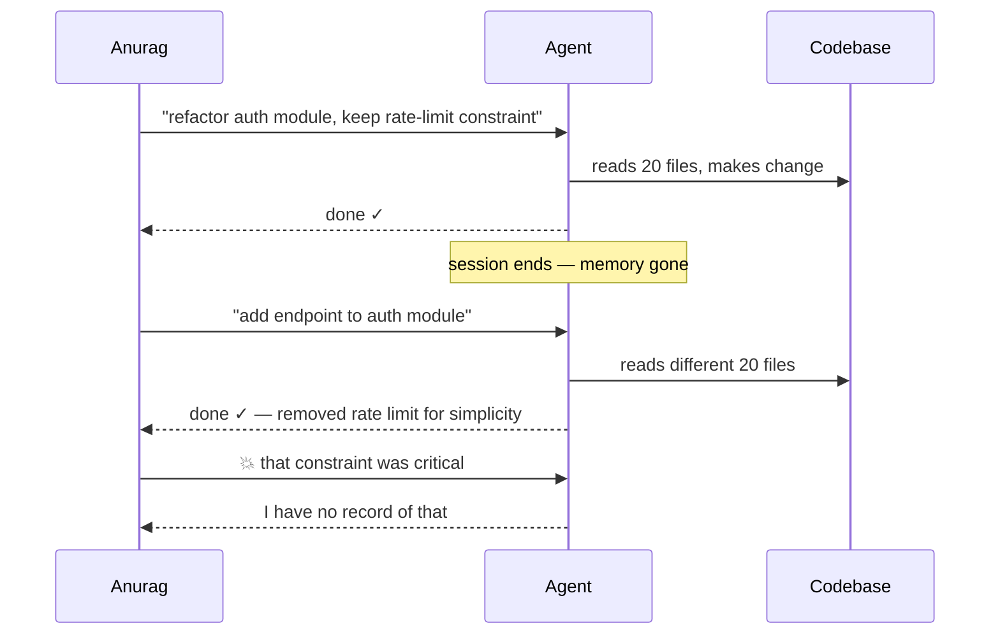
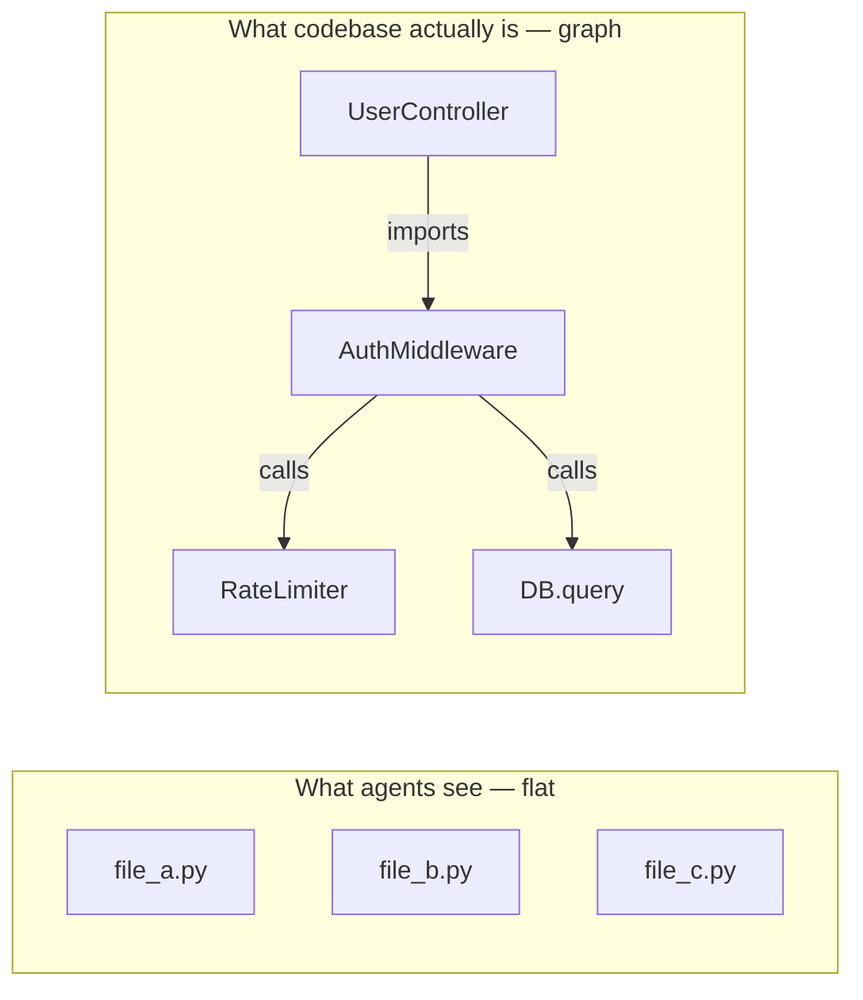
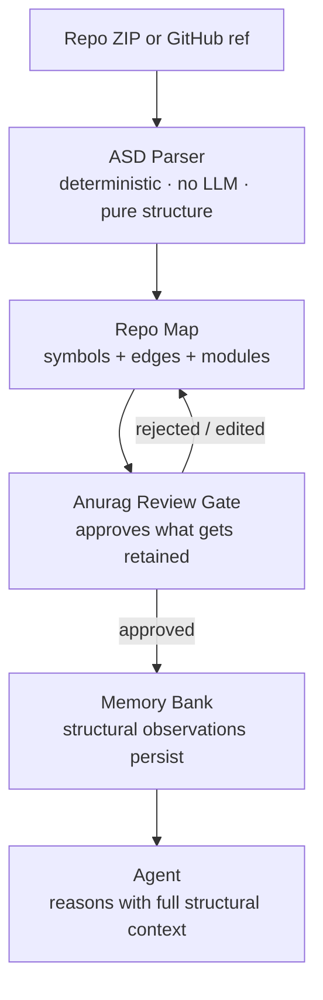
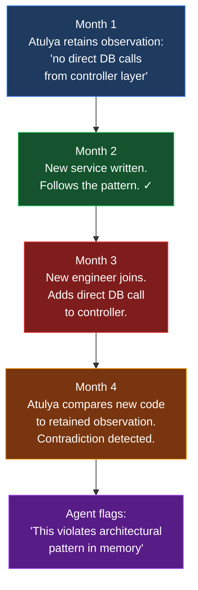

# Code Intelligence: Why It All Started

Agent forget. That core problem.

Not dramatic failure. Quiet one. Agent help Anurag refactor module today. Tomorrow — same agent, same repo — ask about that module. Agent say "I don't have context for that." Like nothing happened.

Worse: agent make change. Confident. No memory of constraint set three sessions ago. Break thing. No warning. Just breakage.

<!-- truncate -->

---

## The Failure Nobody Talks About

Memory gap. Not intelligence gap.

---

## Why Dumping More Context Fails

Obvious fix: bigger context window. More files. Problem solved? No.

| Approach | Cost | Quality | Scales? |
|---|---|---|---|
| Small context (20 files) | Low | Low — wrong files chosen | ✓ |
| Large context (all 400 files) | Very high | Lower — noise drowns signal | ✗ |
| **Smart context (ASD + memory)** | **Low** | **High — structural retrieval** | **✓** |

More context ≠ better reasoning. Dump 50 files — model confused. Important fact buried in noise. Hallucination goes up.

---

## What a Codebase Actually Is

Not just files. Structure.

When agent understand codebase as structure — reason properly. "If I change this signature, what breaks?" Not guess. Trace.

This led to **ASD: Abstract Structural Decomposition**. Mechanical layer. Not LLM. Pure deterministic parse.

| ASD extracts | Example |
|---|---|
| Symbols | `AuthMiddleware`, `RateLimiter`, `validate_token` |
| Import edges | `UserController` imports `AuthMiddleware` |
| Call chains | `AuthMiddleware` → `RateLimiter.check()` → `DB.query()` |
| Test coverage gaps | `payment_service` — 0 tests for error paths |
| Module ownership | `auth/`, `payments/`, `notifications/` |

ASD runs first. Before LLM sees anything. Creates repo map. Stored in memory. Permanently.

---

## The Pipeline: Code → Memory

**Why approval gate matters.** Without it — agent silently rewrites memory. Devs do not want agent memorizing sensitive logic without consent. Gate changes relationship from "agent as spy" → "agent as collaborator."

---

## What Code Intelligence Unlocked

| Capability | Before | After |
|---|---|---|
| **Impact analysis** | "Maybe these files?" — guess | Exact call-graph trace, precise list |
| **Review routing** | Random or manual | PR touches auth → routed to Anurag (owns auth layer) |
| **Onboarding** | Hours of reading | "How does payment flow work?" → seconds from retained structural observations |
| **Drift detection** | Nobody notices | Observation "no direct DB calls from controller" → new code violates it → flagged |

---

## Drift Over Time — Visualized

Not a programmed rule. Pattern lived in memory. New evidence contradicted it. Agent noticed.

---

## Where It Goes Next

| Hard problem ahead | Why hard |
|---|---|
| Semantic drift without structural change | Rename constant — same graph topology, different intent |
| Cross-repo intelligence | Shared types across 20 microservices — entity linking across repo boundaries |
| Decision provenance | "Why was this designed this way?" — trace back through retained decision observations |

Code is living record of decisions. Agent that treats it as living record — useful inside engineering organization. That is why code intelligence started. Not finished.
