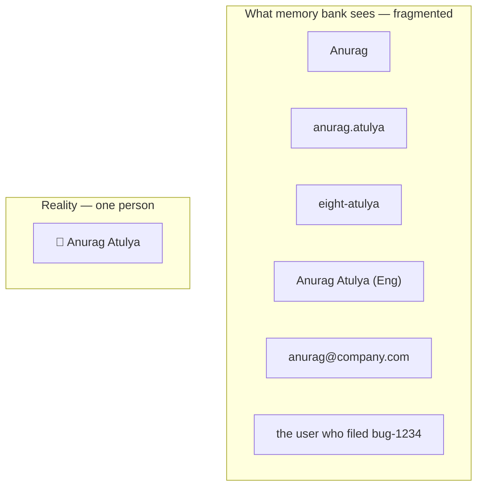
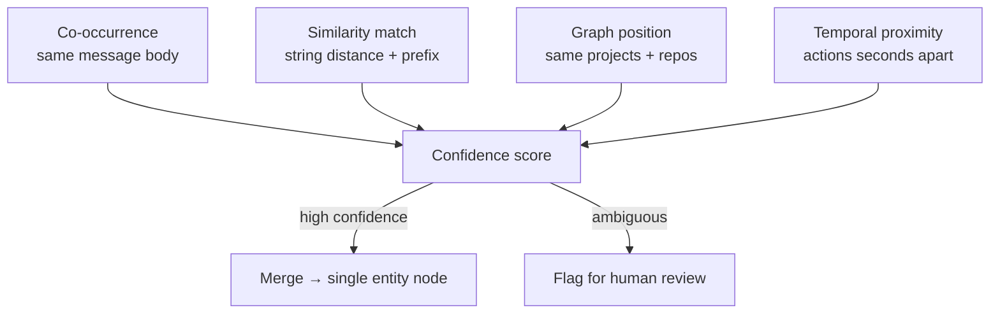
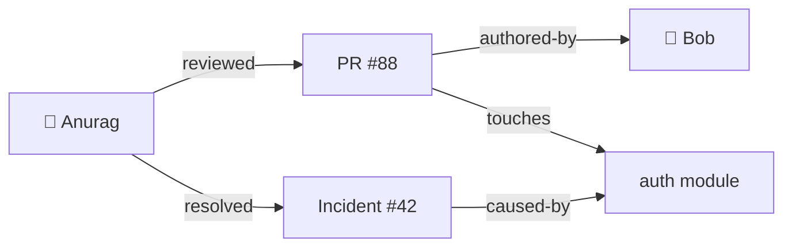
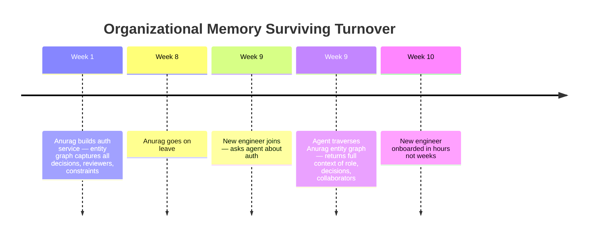

# Entity Intelligence: When Memory Learns Who Is Who

Agent remember fact. "Anurag reviewed PR #88." Good.

Agent remember another fact. "anurag@company.com approved deploy." Good.

Agent asked: "What did Anurag do this week?" Agent say: "I found one PR review. Nothing else."

Wrong. Two facts. Same person. Agent did not know. Looked like two separate entities. Completely unrelated.

This is entity fragmentation. Not edge case. Default state of any system that stores facts without resolving who they are about.

<!-- truncate -->

---

## The Fragmentation Problem

Same person. Six identifiers. Zero connections.

Query: "What has Anurag been working on?" Returns only facts where exact string "Anurag" appears. Misses 80% of relevant data. Retrieval looks broken. Not broken. Never got chance to connect the dots.

---

## Entity Resolution: How It Works

Look at incoming facts. Detect when two mentions = same entity. Merge.

No single signal reliable. All signals combined — high confidence. Atulya runs continuously as facts arrive. Not batch job.

---

## The Graph That Grows

Once entities resolved — connect them.

Graph build itself as facts accumulate. Each new fact adds node, adds edge, strengthens edge weight.

Now ask: **"Who has Anurag collaborated with most in last 30 days?"** Not keyword search. Graph traversal. Find Anurag node → walk edges with timestamp filter → count partners → ranked list.

**"Which engineers touched auth module and also reviewed payment service?"** Graph intersection. Impossible with vector search. Trivial on connected entity graph.

---

## Before vs After Entity Intelligence

| Query | Without entity resolution | With entity graph |
|---|---|---|
| "What did Anurag do this week?" | Finds mentions of exact string "Anurag" | Traverses all 6 identifiers — full picture |
| "Who owns auth?" | Returns whoever mentioned "auth" most | Returns entity with most edges to auth module — weighted by recency |
| "Find all collaborators of Anurag on payments" | Keyword overlap — noisy | Graph path: Anurag → reviewed → PR → touches → payments service → authored-by → `Bob, Carlos, David` |
| "Anomaly: unusual access pattern?" | Not possible | Entity appears in 3 systems normally, suddenly in 8 → flag |

---

## Why This Matters When People Leave

People leave. Entity nodes stay. Relationships stay. Decisions stay. Knowledge of "this person owned this service, these are the decisions they made, these are the people they worked with" — retained.

---

## Digital Person Model

Deeper version: build full dynamic model of person from all retained evidence.

Not profile. Not bio. Evidence-backed behavioral portrait.

| Signal | What it captures |
|---|---|
| PR review patterns | What Anurag approves fast vs scrutinizes |
| Architecture decisions | Which patterns Anurag consistently chose over 6 months |
| Communication style | How Anurag escalates, delegates, unblocks |
| Expertise clusters | Not just title — actual demonstrated knowledge from evidence |
| Collaboration graph | Who Anurag works with by system, by urgency |

Agent reasons: "Anurag would likely flag this API design. He rejected two similar patterns last quarter. Route this review to him before it reaches PR stage." Predictive. Based on real memory of real behavior.

---

## Hard Problems Still Ahead

| Problem | Why hard |
|---|---|
| Two people named "Anurag" on same team | Co-occurrence, similarity, graph — all ambiguous. Human oversight needed |
| Cross-org entities | "Stripe" = company? library? integration? channel? — context-dependent disambiguation |
| Entity model drift | Person changes role — 18-month-old model becomes misleading. When to decay old observations? |

Entity intelligence not optional feature. Foundation. Without it — memory bank accumulates noise that looks like signal. With it — agent actually learns the organization.
