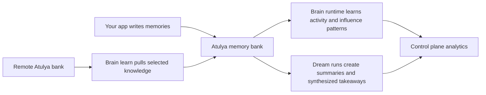
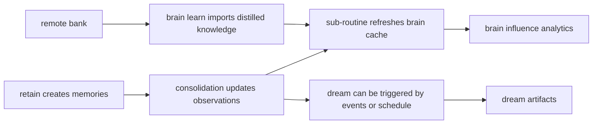

# Brain and Dream

Atulya `0.8` adds a new layer on top of normal memory retrieval.

The simplest way to think about it:

- **Memory** stores what happened.
- **Brain** watches patterns in that memory.
- **Remote brain learning** lets one bank learn from another bank.
- **Dream** turns a pile of memory into higher-level takeaways in the background.

None of this is required to use Atulya. Your app can still just `retain`, `recall`, and `reflect`.
These features are for teams that want Atulya to become more adaptive over time.

## The Big Picture

## What Each Part Does

### Brain

The **brain runtime** is Atulya's background learning layer for a bank.

It does things like:

- refresh a bank-specific brain cache
- learn which hours a bank is usually active
- calculate which memories, chunks, or mental models are currently most influential

This is useful when you want Atulya to do more than simple retrieval. It helps the system understand which knowledge is "hot", which patterns are recurring, and when a bank is likely to be active again.

### BRAIN: the integrity-first direction

The longer-term BRAIN idea is not just "more memory." It is an **integrity layer** that helps Atulya keep its reasoning coherent as a bank grows.

In practical terms, that means pushing toward systems that can:

- notice when new evidence contradicts an older belief instead of silently storing both
- separate normal temporal updates from true inconsistencies
- keep provenance for why a belief, summary, or artifact exists
- localize checks to the affected bank, entity, or scope instead of re-checking everything
- make learning portable across banks and, eventually, across different agent stacks

If memory answers "what happened?", BRAIN tries to answer "is the system still internally consistent?"

That framing matters because long-running agents usually fail from drift, contradictions, and stale assumptions long before they fail from lack of storage.

## Why Integrity Matters

The BRAIN patent draft frames the core problem as **integrity maintenance** for agent memory and reasoning.

That is a useful mental model for Atulya too:

- raw memory alone does not tell you when a belief should be downgraded
- retrieval alone does not explain whether two memories can both be true
- summaries alone do not guarantee that the system's picture of the world is still coherent

An integrity-oriented brain layer helps close that gap by combining memory with checks around contradiction, temporal consistency, provenance, and confidence.

## From Patent Concepts to Product Concepts

The patent draft uses broader systems language than the current product docs. A simple translation table is:

| Patent concept | How to think about it in Atulya docs |
|---|---|
| **Integrity events** | meaningful state changes worth re-checking |
| **Scope-localized verification** | re-check only the bank, entity, or artifact that changed |
| **Proof obligations / certificates** | evidence and traceability for why a conclusion should be trusted |
| **Temporal versioning** | history-aware memory that can explain how understanding changed |
| **Cross-LLM memory sharing** | portable learning across banks and environments |

This page does not claim that every patent concept is already exposed as a public API today. The important point is that Brain, remote learning, and Dream are easier to understand when you see them as pieces of a larger integrity-maintenance architecture.

### Remote Brain Learning

**Remote brain learning** lets one Atulya bank learn from another Atulya bank.

In plain terms:

- Bank A connects to Bank B
- Atulya reads Bank B's learned knowledge
- Atulya distills the useful parts into Bank A

This is helpful when you want a new bank to start with lessons from an older bank, or when you want one environment to absorb knowledge from another without copying everything manually.

### Dream

**Dream** is a background synthesis job.

It takes what the bank already knows and produces a higher-level artifact. Instead of just listing raw memories, Dream tries to answer:

- what themes keep repeating?
- what assumptions seem true?
- what changed recently?
- what might matter next?

Dream runs do not block your app's normal retain, recall, or reflect requests.

## A More Concrete Mental Model

Here is a more realistic way to picture the stack over time:

1. `retain` stores events, observations, and facts.
2. consolidation links and normalizes those memories.
3. Brain tracks activity, influence, and which knowledge appears most "live."
4. Dream turns recurring patterns into higher-level takeaways.
5. the integrity layer checks whether the bank's beliefs still make sense together.

That final step is the big idea behind BRAIN. The goal is not just a bigger memory store, but a memory system that can increasingly explain, defend, and revise its own understanding.

## How They Work Together

## Automatic vs Manual

| Feature | Automatic? | Typical use |
|---|---|---|
| **sub-routine** | Can run on startup or be triggered manually | Refresh brain cache and activity predictions |
| **brain learn** | Manual | Learn from a remote Atulya bank |
| **dream generation** | Manual or scheduled | Produce synthesized artifacts from the bank's knowledge |
| **brain influence** | Query-time analytics | Show what knowledge is most active or important |

## Why This Matters

Without these features, Atulya is already a strong memory system.

With them, Atulya becomes more like a living system that can:

- notice usage patterns
- build analytics for the control plane
- transfer learning between banks
- generate richer, more human-friendly summaries in the background
- move toward integrity-aware reasoning instead of passive storage alone

## Useful Endpoints

### Brain runtime and analytics

- `POST /v1/default/banks/{bank_id}/sub-routine`
- `GET /v1/default/banks/{bank_id}/sub-routine/predictions`
- `GET /v1/default/banks/{bank_id}/sub-routine/histogram`
- `GET /v1/default/banks/{bank_id}/brain/status`
- `GET /v1/default/banks/{bank_id}/brain/influence`

### Remote brain learning

- `POST /v1/default/banks/{bank_id}/brain/learn`

### Dream

- `POST /v1/default/banks/{bank_id}/dreams/trigger`
- `GET /v1/default/banks/{bank_id}/dreams`
- `GET /v1/default/banks/{bank_id}/dreams/stats`

## Minimal Mental Model

If you only remember one thing, remember this:

- **Brain** helps Atulya learn patterns from a bank.
- **Remote brain learning** helps one bank absorb lessons from another bank.
- **Dream** helps Atulya turn many memories into a smaller set of useful takeaways.

## Configuration Pointers

Most Dream settings live under the bank's `dream` config object.

Important knobs include:

- whether Dream is enabled
- whether it runs on events, on a schedule, or both
- how often it can run
- how much input and output it is allowed to use
- whether output should stay extra plain-language with `enforce_layman`

For the raw settings list, see [Configuration](./configuration#dreamtrance-bank-config).

## Where To Look Next

- [**Operations**](./api/operations) for background job behavior
- [**Services**](./services) for where these jobs run
- [**Configuration**](./configuration#dreamtrance-bank-config) for Dream settings
