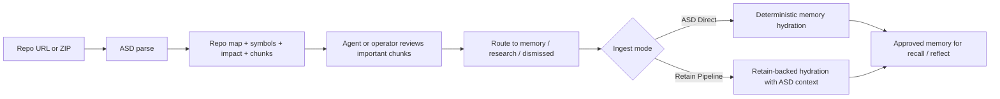

# Codebases For Coding Agents

Codebases is one of the highest-leverage features in Atulya for coding agents because it separates:

- fast mechanical repo understanding
- reviewable operator control
- memory-backed reasoning that should stay trustworthy

That separation is what keeps agent workflows efficient without turning every repo import into an uncontrolled memory mutation.

## The Agent Loop

## Why This Is Efficient

| Problem in many repo tools | What Codebases does instead |
|---|---|
| Clone-heavy indexing | Uses archive-based import for ZIP and public GitHub |
| LLM cost in the hot path | Keeps parsing and graph extraction mechanical first |
| Silent memory mutation | Requires routing and approval before publish |
| Flat file dumps | Promotes semantic chunks, symbols, and impact-aware review |
| One-size-fits-all memory ingestion | Lets the operator choose `ASD Direct` or `Retain Pipeline` |

## When To Use Each Memory Path

| Choose this | When you want | Best fit |
|---|---|---|
| `ASD Direct` | Speed, determinism, low overhead | Bulk repo review, exact chunk archival, lower-cost sync |
| `Retain Pipeline` | Richer semantic linking and stronger memory formation | High-value modules, shared agent memory, strategic code knowledge |

## Recommended Operating Pattern

1. Import the repo from ZIP or public GitHub.
2. Let ASD build the snapshot and review queue.
3. Use repo map, symbol search, and impact to find the meaningful code regions.
4. Route high-value chunks to `memory`.
5. Route exploratory or uncertain chunks to `research`.
6. Approve with `Retain Pipeline` for strategic areas, or `ASD Direct` when speed matters more.
7. Use `recall` and `reflect` only after the approved snapshot matches the code you want agents to trust.

## What Makes The Review Queue Valuable

| Signal | Why agents care |
|---|---|
| Chunk label | Fast triage of meaningfully bounded code |
| Symbol context | Lets the agent connect functions, classes, and modules |
| Related chunks | Helps discover adjacent code without brute-force scanning |
| Impact analysis | Shows likely blast radius for refactors or fixes |
| Route target | Keeps memory, research, and dismissal separate |

## Practical Examples

### Use `ASD Direct`

Use it when:

- you want a quick approved snapshot for exact code recall
- you are reviewing a large repo and want to stay conservative on heavier ingestion
- the chunk is useful as reference but not central to long-lived semantic reasoning

### Use `Retain Pipeline`

Use it when:

- the chunk explains a core subsystem
- multiple agents will rely on this code understanding later
- you want ASD structural context plus richer memory formation
- the code is worth paying a slightly heavier ingest cost for better downstream recall quality

## Release Readiness Checklist

| Release question | Desired answer |
|---|---|
| Can teams inspect structure before memory changes? | Yes |
| Can they route only the right chunks? | Yes |
| Can they choose fast versus richer memory publish? | Yes |
| Can they see what snapshot is approved today? | Yes |
| Can large repos be reviewed progressively? | Yes |

## Where To Go Next

| If you want to... | Read this |
|---|---|
| Understand the whole feature | [Codebases Overview](./codebases) |
| Learn the state machine | [Codebases Lifecycle](./codebases-lifecycle) |
| Use the UI well | [Codebases Control Plane](./codebases-control-plane) |
| Integrate the endpoints | [Codebases API](./codebases-api) |
