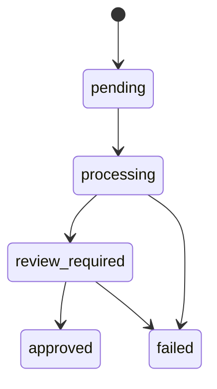
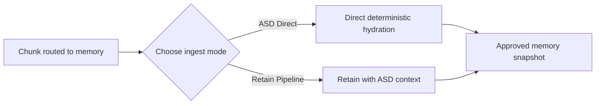

import FeatureCardGrid from '@site/src/components/FeatureCardGrid';

# Codebases Lifecycle

  
Lifecycle

  <h1 className="atulya-hero__title">Import, review, approve, refresh</h1>
  

    The lifecycle is designed so code intelligence can move fast while memory-backed reasoning
    stays deliberate and auditable.
  

<FeatureCardGrid
  cards={[
    {
      icon: '/img/icons/codebases-overview.svg',
      eyebrow: '1. Import',
      title: 'ZIP or GitHub archive',
      description:
        'Both import paths feed the same archive pipeline, so private ZIPs and public GitHub refs behave consistently.',
    },
    {
      icon: '/img/icons/codebases-lifecycle.svg',
      eyebrow: '2. Parse',
      title: 'ASD builds a snapshot',
      description:
        'Atulya extracts the repo map, symbols, and edges into a reviewable snapshot and marks it review_required.',
    },
    {
      icon: '/img/icons/codebases-control-plane.svg',
      eyebrow: '3. Review',
      title: 'Inspect before trusting',
      description:
        'Teams can browse files, search symbols, and inspect impact fan-out before letting the snapshot affect memory.',
    },
    {
      icon: '/img/icons/codebases-api.svg',
      eyebrow: '4. Approve',
      title: 'Hydrate only on approval',
      description:
        'Stable codebase documents are created or updated only when a human approves the reviewed snapshot.',
    },
  ]}
/>

## State Machine

## Step 1: Import

Supported sources in v1:

- ZIP upload
- public GitHub `owner/repo/ref`

The archive itself is stored as source evidence for the snapshot. It is not treated as memory content.

## Step 2: Parse

ASD performs the mechanical pass:

- extract and normalize files
- classify supported versus manifest-only files
- parse supported languages through `tree-sitter`
- build symbols and graph edges
- store a snapshot-level code index

After a successful parse, the snapshot becomes:

- `review_required`

At this point:

- `files` works
- `symbols` works
- `impact` works
- no codebase documents exist in memory yet

## Step 3: Review

The review phase is where the operator decides whether the new snapshot is safe and useful enough to publish into memory.

Questions to ask during review:

- Did ASD pick up the expected files?
- Are the key symbols present?
- Does impact analysis reflect the real code structure?
- Does the new snapshot look better than the last approved one?

## Step 4: Approve

Approval is the publish step for memory.

That step:

- hydrates stable `codebase:{codebase_id}:{path}` documents
- reuses unchanged documents
- updates changed-file documents
- deletes removed-file documents
- advances `approved_snapshot_id`

### The New Approval Decision

Approval is now explicit in two ways:

1. the chunk must already be routed to `memory`
2. the operator chooses the memory ingest mode

| Choice | What happens |
|---|---|
| `ASD Direct` | The exact reviewed chunk is hydrated deterministically with minimal overhead |
| `Retain Pipeline` | The reviewed chunk is sent through Atulya retain with ASD-enriched context for richer memory formation |

## Step 5: Refresh

GitHub-backed codebases support explicit refresh.

If the resolved commit SHA is unchanged:

- refresh returns `noop=true`
- no new review gate is created

If the commit changed:

- a new ASD snapshot is parsed
- code intelligence uses the new `current_snapshot_id`
- memory stays on `approved_snapshot_id` until the new snapshot is approved

## The Most Important Separation

| Field | What it powers |
|---|---|
| `current_snapshot_id` | File map, symbols, impact |
| `approved_snapshot_id` | Memory-backed recall and reflect |

## Lifecycle Decision Table

| Phase | Structural intelligence | Shared memory state |
|---|---|---|
| Import queued | Not yet visible | Unchanged |
| Parse complete | Current snapshot is explorable | Unchanged |
| Review in progress | Chunks, files, symbols, and impact update against current snapshot | Still pinned to approved snapshot |
| Memory approval queued | Current snapshot still explorable | Pending selected ingest path |
| Approval complete | Current snapshot remains explorable | Approved snapshot moves forward |

That split is the heart of the design.

It means the newest code understanding can be visible immediately, while the shared memory state stays conservative until someone approves it.
