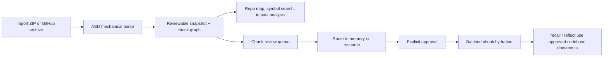
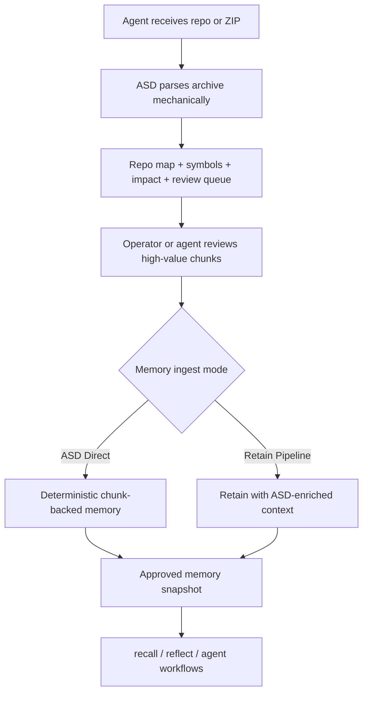
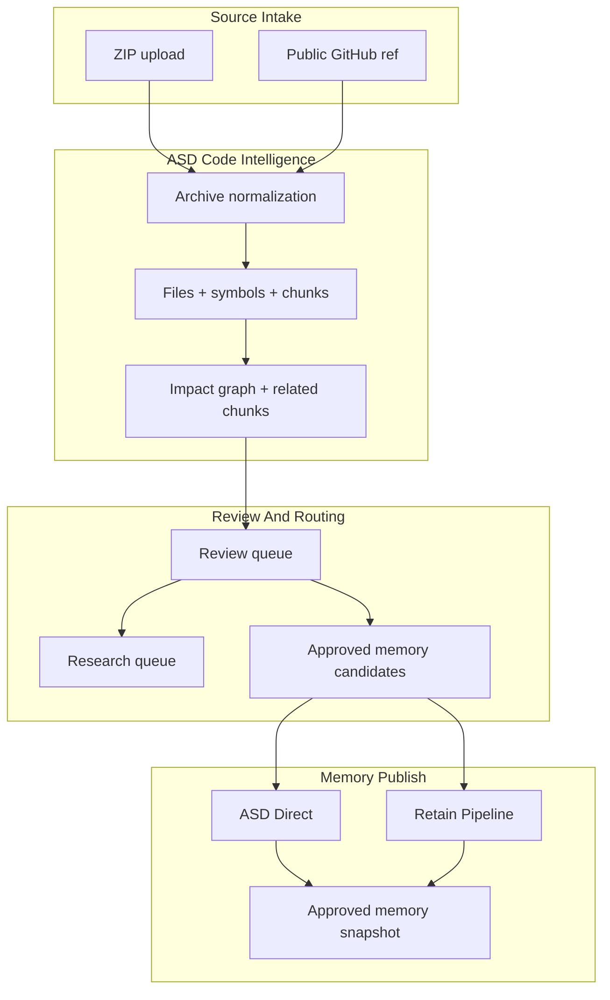

import FeatureCardGrid from '@site/src/components/FeatureCardGrid';

# Codebases

  
Developer Intelligence

  <h1 className="atulya-hero__title">Deterministic code understanding before memory hydration</h1>
  

    Atulya Codebases turns a repository into a reviewable ASD snapshot first, then hydrates memory
    only after explicit approval. That keeps code intelligence fast, mechanical, and token-efficient
    while preventing silent memory drift.
  

  

    <a className="button button--primary button--lg" href="/developer/codebases-lifecycle">
      Explore The Lifecycle
    </a>
    <a className="button button--secondary button--lg" href="/developer/codebases-for-coding-agents">
      Coding Agent Guide
    </a>
    <a className="button button--secondary button--lg" href="/developer/codebases-control-plane">
      See The Control Plane
    </a>
  

<FeatureCardGrid
  cards={[
    {
      icon: '/img/icons/codebases-overview.svg',
      eyebrow: 'ASD First',
      title: 'Parse before memory',
      description:
        'A codebase import creates a reviewable mechanical snapshot first instead of immediately mutating Atulya memory.',
    },
    {
      icon: '/img/icons/codebases-lifecycle.svg',
      eyebrow: 'Review Gate',
      title: 'Human approval is explicit',
      description:
        'Repo map, symbol search, and impact analysis are available before approval, while recall and reflect stay tied to the last approved snapshot.',
    },
    {
      icon: '/img/icons/codebases-api.svg',
      eyebrow: 'Typed Surfaces',
      title: 'Chunk review and routing',
      description:
        'ZIP import, GitHub import, refresh, review, chunks, files, symbols, impact, routing, research queue, and approve are all exposed as typed APIs that fit real developer workflows.',
    },
    {
      icon: '/img/icons/codebases-control-plane.svg',
      eyebrow: 'Operator UX',
      title: 'Control Plane review loop',
      description:
        'The docs and UI are designed around the actual sequence a team follows: import, inspect, compare, approve, and only then hydrate memory.',
    },
  ]}
/>

## The Core Promise

If you only remember one thing, remember this:

- **ASD** gives immediate structural understanding of the repo
- **review routing** decides which semantic chunks belong in memory versus research
- **approval** applies only the chunks already routed to memory
- **Atulya memory** remains stable until a human accepts the new snapshot

## Why Companies Care

Codebases is designed to improve developer efficiency in ways that compound:

- no persistent clone-heavy indexing workflow
- no import-time LLM indexing bill
- deterministic symbol and dependency extraction for supported languages
- review-before-memory so teams do not silently pollute reasoning state
- explicit refresh so GitHub-backed repos stay cheap when nothing changed

That combination is especially useful for:

- engineering teams reviewing large repos
- platform teams operating shared memory banks
- agentic coding workflows where token spend and auditability both matter

## Why Coding Agents Get Faster

The feature matters most when you look at the full agent loop instead of only import.

| Agent need | Codebases answer |
|---|---|
| Understand repo structure quickly | ASD builds the repo map, symbols, chunks, and impact graph immediately |
| Avoid spending tokens on every import | Parsing stays mechanical first and memory hydration is explicit |
| Keep shared memory trustworthy | The latest snapshot is reviewable before it can affect `recall` or `reflect` |
| Stage only the valuable parts of a repo | Chunk routing separates `memory`, `research`, `dismissed`, and `unrouted` work |
| Choose between speed and richer memory formation | The memory modal now exposes `ASD Direct` versus `Retain Pipeline` |

## Release Readiness At A Glance

| Surface | What is ready |
|---|---|
| Import | ZIP and public GitHub archive import |
| Parse | ASD-first snapshot creation with chunk graph and deterministic diagnostics |
| Review | Review queue, repo map, symbol search, impact, research queue, approved memory history |
| Memory publish | Explicit approval with `ASD Direct` or `Retain Pipeline` selection |
| Refresh | GitHub refresh with `noop` when the commit SHA has not changed |
| Operator UX | Progressive loading for large repos and modal detail flows instead of full-page overload |

## How The Pieces Fit Together

| Layer | Primary job | Why it matters |
|---|---|---|
| Archive import | Normalize ZIP and GitHub sources into one pipeline | Keeps ingestion predictable and clone-free |
| ASD mechanical parse | Build files, symbols, chunks, clusters, and graph edges | Gives coding agents structural understanding before memory |
| Review routing | Decide what belongs in `memory`, `research`, or nowhere | Prevents low-value code from polluting shared reasoning |
| Memory ingestion | Publish approved chunks with `ASD Direct` or `Retain Pipeline` | Lets teams balance speed against richer memory formation |
| Memory-backed reasoning | Power `recall` and `reflect` from the approved snapshot | Keeps shared reasoning conservative and auditable |

## What ASD Owns

ASD is the proprietary mechanical code-intelligence layer. In v1 it owns:

- archive extraction and filtering
- path normalization
- language detection
- `tree-sitter` parsing for supported languages
- symbol extraction
- import and dependency edge construction
- normalized repo-map metadata

Deep parsing is strongest today for:

- Python
- JavaScript
- TypeScript
- JSX
- TSX

Unsupported languages still appear in the manifest and file map, but they do not pretend to have deep graph intelligence.

## How The System Is Split

| Layer | What it is for |
|---|---|
| `Codebases` | Deterministic code intelligence |
| `retain` | General memory ingestion |
| `recall` | Memory retrieval |
| `reflect` | Memory-backed reasoning |

This separation is intentional.

Code understanding should be mechanical first. Memory-backed reasoning should happen only after the reviewed source state is approved.

## Operator Decision Table

| If the team needs... | Use this path |
|---|---|
| Exact deterministic code persistence with minimal overhead | `ASD Direct` |
| Richer semantic linking into Atulya memory | `Retain Pipeline` |
| Structural review without touching memory yet | Review Queue + Repo Map + Symbol Search + Impact |
| Deeper follow-up without publishing to memory | Research Queue |
| Trusted reasoning against the current approved repo state | `recall` and `reflect` after approval |

## Where To Go Next

| If you want to... | Start here |
|---|---|
| Understand the exact state machine | [Codebases Lifecycle](./codebases-lifecycle) |
| Inspect the UI review loop | [Codebases Control Plane](./codebases-control-plane) |
| Integrate the endpoints directly | [Codebases API](./codebases-api) |
| Optimize coding-agent workflows | [Codebases For Coding Agents](./codebases-for-coding-agents) |
| Understand auto-triage, gold artifacts, and intent curation | [Codebases Code Intelligence](./codebases-code-intel) |

## Practical Guidance

| Situation | Recommended move |
|---|---|
| Private or curated repo snapshot | ZIP import |
| Public repo with cheap explicit refresh | GitHub import |
| Large repo where only a few code regions matter | Route only high-value chunks to memory |
| Core subsystem that future agents should deeply understand | Approve through `Retain Pipeline` |
| Broad repo sync where cost and determinism matter more | Approve through `ASD Direct` |

Use ZIP import when:

- the repo is private
- you want an offline or curated snapshot
- you want exact archive control

Use GitHub import when:

- the repo is public
- you want explicit refresh against a ref
- you want a no-op result when the commit SHA has not changed

## Before Versus After Approval

| Stage | What developers can do | What memory sees |
|---|---|---|
| Parsed but unapproved | Inspect repo map, symbols, chunks, impact, and routes | Memory stays on the older approved snapshot or empty |
| Routed for memory | Choose the best chunks and select the ingest mode | Memory still does not move until approval runs |
| Approved | Query approved chunk history and trust the new snapshot | `recall` and `reflect` use the approved codebase documents |

## What This Is Not

Codebases is not trying to replace general memory operations.

Instead:

- `Codebases` is the precise structural layer
- `retain`, `recall`, and `reflect` stay the semantic and reasoning layer
- approval is the bridge between the two

That is what keeps the fast path efficient and the memory path trustworthy.
