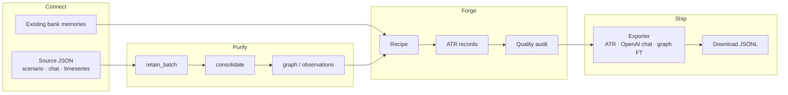
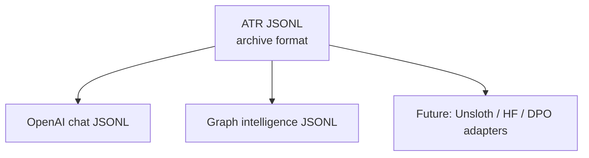
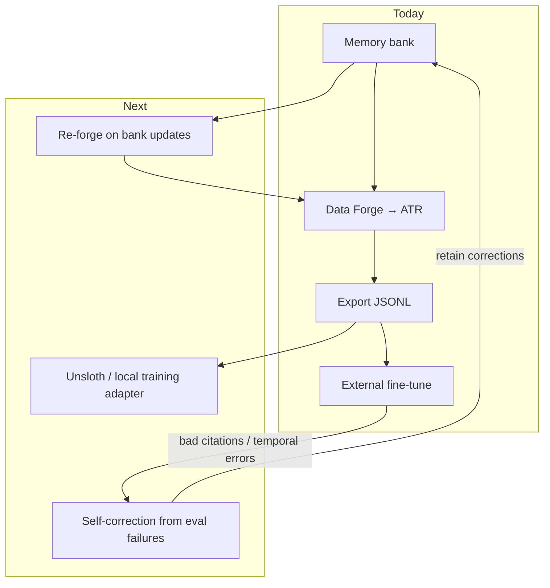

# Data Forge

Turn messy real-world data into **audited training records** — with citations, timelines, and provenance you can inspect before export.

Data Forge sits on top of the same pipeline you already use for memory: **retain → consolidate → recall/reflect → graph**. It does not replace that stack. It **materializes** what the stack already knows into a portable format (ATR) that fine-tuning tools can consume.

For hand-curated examples (import, edit, generate variants, send to memory without running a recipe), use **[Taste Studio](./taste-studio.md)** — the curation lane beside pipeline forge. See also: [Intuition is taste](/blog/taste) by Anurag Atulya.

---

## The problem in one sentence

Most teams can *store* conversations and documents. Few can *prove* what their model should learn from them — and ship a dataset without silent garbage.

| What teams do today | What breaks | What Forge adds |
|---------------------|-------------|-----------------|
| Export raw chat logs | No citations, no timeline grounding | Records link answers to specific memory IDs |
| Hand-label JSONL in a spreadsheet | Expensive, drifts from source truth | Recipes generate labels from live bank state |
| RAG + hope | Retrieval at inference ≠ training signal | Training examples built from the same recall/reflect paths you trust in prod |
| One-off export scripts | No quality gate, no versioning | Quality audit + optional memory-repo commit per export |

---

## Business ROI (plain numbers logic)

| Stakeholder | Without Forge | With Forge |
|-------------|---------------|------------|
| **ML / applied AI** | Weeks scripting ETL; debugging “why did the model hallucinate this?” | Recipe pick → preview held-back rows → export JSONL |
| **Compliance / risk** | “We trained on customer data” with weak lineage | Per-record provenance: document IDs, cited memories, quality issues |
| **Product / ops** | Memory product stops at “search my notes” | Same bank powers agents **and** fine-tunes — one source of truth |
| **Finance** | Duplicate labeling + re-ingest when memory improves | Re-run forge when bank updates; diff via memory repos (roadmap) |

**Compounding effect:** Every `retain` makes the bank smarter. Every forge run turns that intelligence into **durable model capability** instead of throwaway context window.

---

## How it works



### Operator flow (control plane)

Three steps — same mental model as the API:

| Step | What you do | What happens under the hood |
|------|-------------|----------------------------|
| **1. Connect** | Choose domain profile + source type; edit JSON template | Ingest adapters normalize to `retain_batch` payloads |
| **2. Purify & forge** | Pick recipe + quality threshold; start job | Async operation: ingest → consolidate → recipe → audit |
| **3. Preview & export** | Inspect held-back rows; download format | Exporters filter by threshold; lineage manifest attached |

Job stages (poll via [Operations](./api/operations)):

| Stage ID | Label | Meaning |
|----------|-------|---------|
| `queued` | Queued | Job accepted |
| `ingest` | Ingesting source | Source normalized and retained |
| `purify` | Purifying memories | Consolidation (optional wait) |
| `recipe` | Generating training records | Recipe reads bank state |
| `audit` | Quality audit | Scores + exportable flag per record |
| `repo_commit` | Versioning dataset | Optional memory-repo snapshot |

---

## Atulya Training Record (ATR)

**ATR** is the canonical intermediate format. Think of it as a **labeled snapshot of memory state** at forge time — not a chat log dump.

### Top-level fields

| Field | Purpose |
|-------|---------|
| `record_id` | Stable ID for this training example |
| `forge_job_id` | Links back to the async operation |
| `bank_id` | Tenant isolation (one bank per request) |
| `recipe_id` | Which recipe produced this row |
| `timeline` | Multi-session turns with dates |
| `facts` / `observations` | Evidence snapshots cited in labels |
| `graph` | Graph intelligence nodes (when recipe uses graph) |
| `labels` | Answer, citations, tool traces, belief updates, etc. |
| `provenance` | Document and chunk IDs from ingest |
| `quality` | Score, issues, `exportable` boolean |
| `lineage` | Recipe version, repo commit (when enabled) |

### Why ATR first, exporters second



Export adapters are **thin transforms**. Your long-term archive should be ATR — future training stacks (including on-device Unsloth runs) can add adapters without re-ingesting source data.

---

## Recipes

Recipes are **opinionated generators**: they run recall, reflect, consolidation, or graph APIs and emit ATR rows.

| Recipe ID | Training signal | Needs new ingest? | Typical cost |
|-----------|-----------------|-------------------|--------------|
| `consolidation_pairs` | Fact → observation summarization with `source_memory_ids` | No (bank-only OK) | Low |
| `temporal_qa` | Multi-hop Q&A with **memory citations** | No | Medium |
| `agent_trace` | Full reflect tool trace (recall, expand, done) | No | High (LLM) |
| `graph_state` | Graph node status labels (stable / changed / contradictory) | No | Low |
| `belief_update` | Before/after observation text when evidence changes | No | Low |
| `synthetic_expand` | Multi-session timelines from seed scenarios | **Yes** (scenario source) | High |

### Domain profiles (suggested recipes)

| Profile | Use case | Suggested recipes |
|---------|----------|-------------------|
| `startup_ops` | Incidents, deals, product decisions | `agent_trace`, `temporal_qa`, `consolidation_pairs` |
| `family_office` | Holdings, beneficiaries, compliance | `belief_update`, `temporal_qa`, `graph_state` |
| `macro` | Indicators, geopolitical time series | `belief_update`, `graph_state`, `consolidation_pairs` |
| `social` | Feeds and conversational streams | `consolidation_pairs`, `temporal_qa` |
| `synthetic` | Generated multi-session data | `synthetic_expand`, `graph_state` |

Pass `domain_tags` when listing recipes or submitting jobs to get tailored suggestions.

---

## Ingest sources

| `source_type` | Accepts | Normalizes to |
|---------------|---------|---------------|
| `scenario` | Dated facts, supersession chains, expected answers | `retain_batch` items |
| `chat` | Sessions with turns (or LoCoMo-style conversation shape) | `retain_batch` items |
| `timeseries` | Rows or CSV text with key/value/timestamp columns | `retain_batch` items |
| `bank_only` | *(no payload)* | Uses memories already in the bank |

Validation runs **before** the job is queued. Invalid JSON or empty required fields return `400` with a structured error (`field`, `message`) — fix in the UI or CLI without digging through worker logs.

---

## Quality audit

Every record is scored before export. The audit is deterministic (no LLM judge in v1) — fast, reproducible, CI-friendly.

| Check | What it means | Example issue |
|-------|---------------|---------------|
| Provenance | Answer must cite real evidence | `answer present without memory citations` (temporal Q&A, agent trace) |
| Citations | Cited IDs must exist in the record snapshot | `cited memory X not in record` |
| Temporal | Query anchor vs fact timestamps | `query_anchor precedes earliest fact` |
| Contradictions | Unresolved contradictory graph nodes | Held back unless `belief_update` recipe |
| Threshold | Overall score ≥ your slider / API param | Row marked `exportable: false` |

**Held-back records are a feature.** They tell you *why* a row is not safe to train on — before you spend GPU hours.

---

## Exporters

| Adapter ID | Output | Best for |
|------------|--------|----------|
| `atr_jsonl` | Full ATR per line | Archive, custom pipelines, future Unsloth adapter |
| `openai_chat_jsonl` | `messages[]` per line | OpenAI / compatible SFT |
| `graph_intelligence_jsonl` | Graph FT schema | Graph classification fine-tunes |

Export respects `quality_threshold` — same semantics as the control-plane slider.

---

## API and CLI

- **HTTP:** [Forge API reference](./api/forge)
- **CLI:**

```bash
uv run atulya-admin forge run \
  --bank my-bank \
  --recipe temporal_qa \
  --domain-tag startup_ops \
  --source-file ./scenario-seed.json \
  --wait
```

- **Control plane:** Bank → **Data Forge** tab (connect → purify → preview → export)

---

## Roadmap: memory that trains itself

Data Forge is **phase 1** of a closed loop Atulya calls the **knowledge compression loop**:



| Phase | Capability | Outcome |
|-------|------------|---------|
| **Now** | Forge + quality audit + exporters | Ship cited datasets from live memory |
| **Next** | Memory-repo versioning on export | Diff datasets when bank evolves |
| **Planned** | **Unsloth** adapter + bundled training job | Self-contained fine-tune without leaving the stack |
| **North star** | Eval-driven retain + re-forge | Model and memory **co-improve** — errors become new facts, not repeated mistakes |

See also: the repo architecture note [knowledge compression loop](https://github.com/eight-atulya/atulya/blob/main/docs/architecture/knowledge-compression-loop.md) and the blog post [From Memory to Model](/blog/memory-that-trains-itself).

---

## Related docs

- [Retain](./retain) — what purification starts from
- [Recall](./retrieval) — retrieval paths recipes reuse
- [Reflect](./reflect) — agent traces and temporal Q&A
- [Memory Repos](./memory-repos) — versioning exported datasets
- [Graph Intelligence](./control-plane-graph-intelligence) — graph_state recipe inputs
- [Operations](./api/operations) — polling async forge jobs
