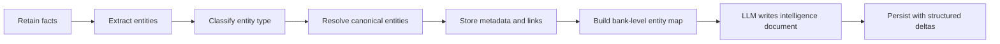

# Entity Intelligence

Entity intelligence is a bank-level synthesis built from the bank's entity graph. It looks across
people, tools, companies, projects, concepts, events, trajectories, and co-occurrence links to produce
a readable "digital person" map for the bank.

Unlike an entity trajectory, which explains one entity at a time, entity intelligence summarizes the
whole bank. It is designed to answer:

- Who and what are important in this bank?
- Which people, tools, companies, projects, and concepts are connected?
- What does the bank already know about the user or system?
- What risks, opportunities, and likely next needs are visible from the entity graph?
- Which entities are still ambiguous and need better metadata?

## How It Works



During retain, extracted entities can carry optional root classification metadata:

```json
{
  "text": "Antara Das",
  "entity_type": "person",
  "confidence": 0.9,
  "evidence": "named person in the fact",
  "role_hint": "partner"
}
```

This metadata is stored in `entities.metadata` and reused by the bank-level intelligence job. Older
entities without metadata still work; the intelligence builder falls back to conservative name and
graph heuristics.

## Entity Types

The root classifier uses these semantic types:

| Type | Meaning |
|---|---|
| `person` | A human being, even if there is no title like Mr, Ms, or Dr |
| `organization` | A company, team, institution, or platform owner |
| `tool` | Software, hardware, model, API, service, or technical utility |
| `project` | Product, codebase, feature, initiative, or named work stream |
| `place` | Location, venue, city, country, or area |
| `concept` | Theme, value, concern, skill, preference, or abstract idea |
| `event` | Plan, milestone, meeting, migration, wedding, release, or decision |
| `artifact` | File, URL, document, message surface, or digital object |
| `unknown` | Not enough evidence to classify confidently |

The system stores confidence and evidence when available. Entity intelligence should treat uncertain
entities as uncertain instead of pretending that every name is classified perfectly.

## Output Shape

The generated document is markdown rendered in the Control Plane. The prompt asks for plain language,
no unexplained jargon, and explicit entity connection detail. Useful sections include:

- Digital Person Snapshot
- People Circles
- Tools, Companies, and Projects
- Connection Map
- Mind and Life Themes
- What This Lets Us Predict
- Unknowns to Resolve

The Control Plane exposes this in the Trajectories view under **Bank entity intelligence**. The panel
supports recompute, rendered markdown, and copy-to-clipboard.

## Delta Updates

Entity intelligence is stored as a structured document and updated with delta operations, similar to
mental models. On later runs, the worker sends the previous document plus the latest entity map and
asks the LLM for targeted changes instead of rewriting everything.

This keeps stable insights from drifting while allowing new people, tools, projects, risks, and
relationships to appear as the bank changes.

## Configuration

The feature is bank-configurable and can also be set from environment variables:

| Environment variable | Purpose | Default |
|---|---|---|
| `ATULYA_API_ENABLE_ENTITY_INTELLIGENCE` | Enables bank-level entity intelligence | `false` |
| `ATULYA_API_ENTITY_INTELLIGENCE_TRIGGER_ENTITY_DELTA` | Auto-recompute after this many new/touched entities | `8` |
| `ATULYA_API_ENTITY_INTELLIGENCE_MIN_ENTITIES` | Minimum entities required before running | `8` |
| `ATULYA_API_ENTITY_INTELLIGENCE_MAX_ENTITIES` | Maximum entities included in the prompt inventory | `2000` |
| `ATULYA_API_ENTITY_INTELLIGENCE_MAX_CONTEXT_TOKENS` | Input context budget for the entity map | `10000` |
| `ATULYA_API_ENTITY_INTELLIGENCE_MAX_COMPLETION_TOKENS` | Output token budget for the intelligence document or delta ops | `4096` |
| `ATULYA_API_ENTITY_INTELLIGENCE_PROMPT_VERSION` | Prompt/map version | `v2-digital-person-map` |

Dedicated LLM settings are also available when the job should use a larger or slower local model:

```bash
ATULYA_API_ENTITY_INTELLIGENCE_LLM_PROVIDER=lmstudio
ATULYA_API_ENTITY_INTELLIGENCE_LLM_API_KEY=lmstudio
ATULYA_API_ENTITY_INTELLIGENCE_LLM_BASE_URL=http://localhost:1234/v1
ATULYA_API_ENTITY_INTELLIGENCE_LLM_MODEL=local-model-name
ATULYA_API_ENTITY_INTELLIGENCE_LLM_TIMEOUT=900
ATULYA_API_ENTITY_INTELLIGENCE_LLM_MAX_RETRIES=3
ATULYA_API_ENTITY_INTELLIGENCE_LLM_INITIAL_BACKOFF=2
ATULYA_API_ENTITY_INTELLIGENCE_LLM_MAX_BACKOFF=120
```

## API

Fetch the latest intelligence document:

```http
GET /v1/default/banks/{bank_id}/entity-intelligence
```

Queue a recompute:

```http
POST /v1/default/banks/{bank_id}/entity-intelligence/recompute
```

The recompute endpoint returns an async operation ID. Check the Operations API or Control Plane
background operations list for completion.
