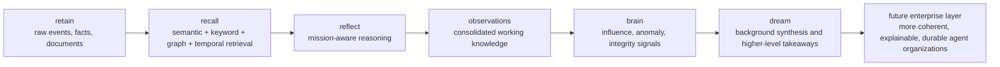
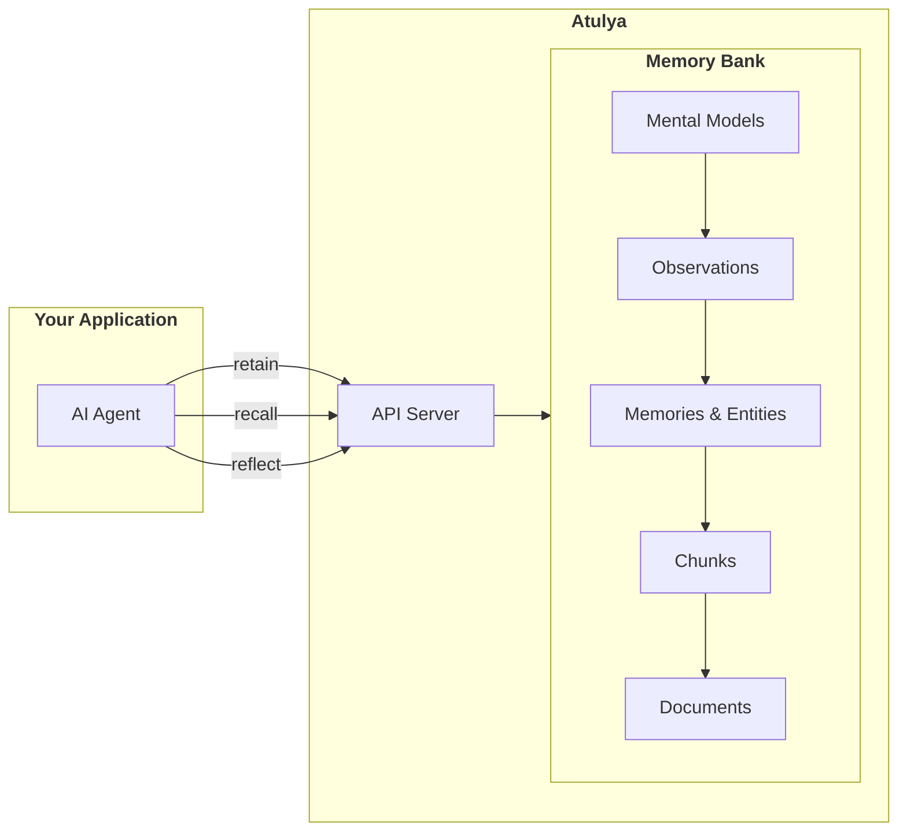
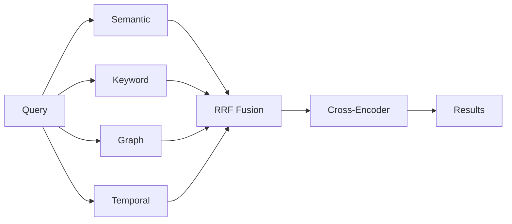

# Overview

## Why Atulya?

Most agent systems fail long before the model fails.

The real problem is not just "memory." It is **continuity, integrity, and organizational coherence** across long-running agents, teams, tools, and time.

A single chatbot forgetting prior context is annoying. In an enterprise agentic organization, the same failure becomes much more expensive:

- agents lose operational context between sessions
- facts drift apart across tools, repos, docs, and conversations
- decisions become hard to audit, explain, or trust
- multiple agents can act on inconsistent assumptions
- knowledge stays trapped inside one runtime instead of becoming reusable organizational memory

This is exactly the direction behind the broader **BRAIN** thesis: memory must evolve from passive storage into an integrity-oriented system that helps agents stay internally consistent, temporally coherent, and operationally trustworthy.

**The problem is harder than it looks:**

- **Simple vector search isn't enough** — "What did Alice do last spring?" requires temporal reasoning, not just semantic similarity
- **Facts get disconnected** — Knowing "Alice works at Google" and "Google is in Mountain View" should let you answer "Where does Alice work?" even if you never stored that directly
- **AI Agents need to consolidate knowledge** — A coding assistant that remembers "the user prefers functional programming" should consolidate this into an observation and weigh it when making recommendations
- **Context matters** — The same information means different things to different memory banks with different personalities
- **Enterprise agents need provenance and guardrails** — It is not enough to answer well; organizations need to know where the answer came from, what evidence supports it, and which rules shaped the decision
- **Long-running systems need integrity, not just recall** — When new evidence contradicts old beliefs, the system should not silently accumulate inconsistency

Atulya solves these problems with a memory system designed specifically for AI agents, and it points toward a future where agents operate with stronger integrity, better organizational memory, and more durable reasoning over time.

## Featured: Graph Intelligence

One of Atulya's most useful Control Plane features is **Graph Intelligence**.

It helps humans understand a memory bank in the same way they naturally review knowledge:

- start with what changed
- see why Atulya believes it
- open the supporting evidence only when needed

Instead of starting from a primitive raw graph, Graph Intelligence starts from meaning.

Use it when you want to:

- review how a customer, repo, incident, or workflow changed
- spot stale assumptions and conflicting evidence
- move from a short answer to the exact proof path

See [Control Plane Graph Intelligence](./control-plane-graph-intelligence) for the full walkthrough.

## Featured: Codebases

Another Control Plane feature aimed directly at developers is **Codebases**.

It lets teams import a repository from a ZIP archive or public GitHub ref, parse it through Atulya's mechanical ASD layer, and review the resulting snapshot before any code text is hydrated into memory.

This matters because code intelligence and memory are intentionally separated:

- `ASD` gives immediate repo map, symbol search, and impact analysis
- memory hydration happens only after explicit approval
- `recall` and `reflect` stay aligned to the last approved snapshot

That keeps the developer workflow fast and deterministic without silently growing LLM-backed memory from every import.

See [Codebases](./codebases) for the full lifecycle.

## Why This Matters For Enterprise Agentic Organizations

Enterprise agentic organizations do not just need assistants that can answer questions. They need systems that can:

- preserve operational memory across days, teams, and workflows
- connect facts across tickets, code, documents, logs, and user interactions
- keep reasoning aligned with mission, policy, and role
- support many agents working on shared reality instead of isolated chat histories
- make decisions explainable enough for review, governance, and recovery

That is the gap between a helpful demo and a durable organizational substrate.

Atulya is built for that substrate. It gives each agent or workflow a structured memory bank, retrieval across semantic, keyword, graph, and temporal signals, and a consolidation layer that turns repeated raw facts into higher-level observations.

The BRAIN direction extends that idea further: not just remembering more, but maintaining integrity across what the system believes, why it believes it, and how those beliefs evolve.

## Atulya Today, BRAIN Direction Tomorrow

The easiest way to think about the roadmap is:

| Layer | What it means |
|------|----------------|
| **Atulya today** | Persistent memory, multi-strategy retrieval, observation consolidation, and configurable reasoning context |
| **BRAIN direction** | Integrity-aware agent infrastructure with contradiction handling, provenance, temporal coherence, portable learning, and stronger organizational trust |

You do not need the full BRAIN vision to get value from Atulya. But that vision explains why Atulya is structured the way it is: as a foundation for long-running, enterprise-grade agent systems rather than a thin chat memory add-on.

Today, Atulya already covers the left side of this flow strongly. Brain and Dream represent the path toward richer background learning, better integrity maintenance, and more durable organizational memory.

## What Atulya Does

**Your AI agent** stores information via `retain()`, searches with `recall()`, and reasons with `reflect()` — all interactions with its dedicated **memory bank**.

That bank is more than a transcript store. It is the beginning of a durable reasoning layer for the agent.

## Where The Math And Continuous Learning Actually Happen

Atulya is not just "an LLM with memory." Under the hood, it combines symbolic structure, retrieval math, neural ranking, and continuous background consolidation.

Just as importantly, Atulya does **not** depend on heavyweight online training in the request path. The system keeps learning by continuously updating memory structure, observations, influence signals, and retrieval state as new evidence arrives.

### The Pipeline

| Pipeline step | Math / ML being applied | What it does in practice | Why it matters later |
|------|---------------------------|--------------------------|----------------------|
| **1. Fact extraction** | Structured LLM extraction + temporal normalization | Converts raw text into facts, entities, causal hints, and time-aware memory units | Stops future retrieval from collapsing into unstructured chat logs |
| **2. Embeddings + indexing** | Dense embeddings + vector similarity indexing | Encodes memories into searchable vectors and makes semantic lookup fast | Solves scale bottlenecks when the memory bank becomes too large for naive scanning |
| **3. Entity resolution + links** | Similarity matching, co-occurrence stats, weighted graph edges | Connects facts that refer to the same people, places, systems, or concepts | Prevents organizational knowledge from fragmenting into disconnected shards |
| **4. Multi-strategy retrieval** | Semantic search, BM25, graph traversal, temporal filtering | Runs multiple retrieval strategies in parallel instead of betting on one | Handles future enterprise queries that are semantic, exact-match, relational, and time-sensitive at once |
| **5. Fusion** | Reciprocal Rank Fusion: `score(d) = Σ 1 / (k + rank(d))` | Blends independent ranked lists into a more stable candidate set | Reduces ranking brittleness when one retrieval method underperforms |
| **6. Neural reranking** | Cross-encoder scoring + sigmoid normalization + multiplicative recency/temporal boosts | Re-scores query-document pairs using a stronger relevance model | Helps the right evidence win when the memory bank gets noisy or crowded |
| **7. Observation consolidation** | Bottom-up synthesis over repeated evidence | Converts clusters of raw facts into reusable observations with evidence trails | Turns storage into working knowledge instead of endless accumulation |
| **8. Brain analytics** | Exponential decay, weighted influence scoring, EWMA trend, robust z-score, IQR anomalies | Tracks what is hot, fading, recurring, or anomalous in a bank over time | Creates the basis for continuous learning without unstable always-training loops |

### Read It Like A Factory

| Factory metaphor | What Atulya is doing |
|------|----------------|
| **Raw intake** | `retain` turns messy events into structured facts |
| **Sorting belt** | entities, timestamps, and links organize the evidence |
| **Four inspectors** | semantic, keyword, graph, and temporal retrieval all examine the query |
| **Merge desk** | Reciprocal Rank Fusion combines their ranked opinions |
| **Final judge** | the cross-encoder reranker decides what is most relevant |
| **Night shift** | consolidation and Brain analytics keep upgrading the bank after the request is over |

That is why Atulya feels more like an evolving system than a cache.

## Continuous Learning Without Fragile Online Training

When people hear "continuous machine learning," they often imagine gradient updates happening live in production.

That is **not** the only way to build a system that learns continuously.

Atulya's current approach is safer for enterprise operations:

| Learning loop | What changes continuously | Why this is production-friendly |
|------|---------------------------|---------------------------------|
| **Memory growth** | New facts, experiences, and documents enter the bank | The system keeps learning from fresh evidence |
| **Observation refinement** | Existing observations are updated, merged, or replaced as new evidence arrives | Knowledge evolves instead of freezing at first impression |
| **Temporal adaptation** | Recency and time-aware retrieval change what matters now | The system naturally shifts attention as reality changes |
| **Influence analytics** | Brain scores update from access patterns, graph position, rerank signals, and dream signals | The bank learns what is operationally important without retraining the whole model |
| **Anomaly detection** | Statistical methods surface unusual shifts and outliers | Helps future integrity workflows notice drift before it becomes failure |

In other words: Atulya learns by **rewriting its memory state**, not by blindly fine-tuning itself every time someone talks to it.

That distinction matters for future enterprise agentic organizations, because they need systems that can improve continuously while staying explainable, recoverable, and governable.

## Key Components

### Memory Types

Atulya organizes knowledge into a hierarchy of facts and consolidated knowledge:

| Type | What it stores | Example |
|------|----------------|---------|
| **Mental Model** | User-curated summaries for common queries | "Team communication best practices" |
| **Observation** | Automatically consolidated knowledge from facts | "User was a React enthusiast but has now switched to Vue" (captures history) |
| **World Fact** | Objective facts received | "Alice works at Google" |
| **Experience Fact** | Bank's own actions and interactions | "I recommended Python to Bob" |

During reflect, the agent checks sources in priority order: **Mental Models → Observations → Raw Facts**.

### Multi-Strategy Retrieval (TEMPR)

Four search strategies run in parallel:

| Strategy | Best for |
|----------|----------|
| **Semantic** | Conceptual similarity, paraphrasing |
| **Keyword (BM25)** | Names, technical terms, exact matches |
| **Graph** | Related entities, indirect connections |
| **Temporal** | "last spring", "in June", time ranges |

### Why This Math Matters

| Real bottleneck coming next | How Atulya addresses it |
|------|--------------------------|
| **Context-window ceilings** | Persistent memory banks keep knowledge outside the prompt while still making it retrievable |
| **Ranking collapse in large memory stores** | Parallel retrieval plus fusion and reranking reduce dependence on any single weak signal |
| **Temporal drift** | Time-aware retrieval and recency scoring stop stale memories from dominating current decisions |
| **Knowledge fragmentation across teams and tools** | Entity linking, graph retrieval, and observation consolidation reconnect scattered evidence |
| **Operational trust and governance** | Evidence-backed observations, directives, and mission-aware reasoning make behavior easier to review |
| **Future integrity bottlenecks** | The BRAIN direction adds contradiction handling, provenance, and stronger coherence checks on top of the current pipeline |

### Observation Consolidation

After memories are retained, Atulya automatically consolidates related facts into **observations** — synthesized knowledge representations that capture patterns and learnings:

- **Automatic synthesis**: New facts are analyzed and consolidated into existing or new observations
- **Evidence tracking**: Each observation tracks which facts support it
- **Continuous refinement**: Observations evolve as new evidence arrives

This matters in enterprise settings because raw event storage alone does not create organizational knowledge. Consolidation is what turns repeated facts into reusable working understanding.

### Mission, Directives & Disposition

Memory banks can be configured to shape how the agent reasons during `reflect`:

| Configuration | Purpose | Example |
|---------------|---------|---------|
| **Mission** | Natural language identity for the bank | "I am a research assistant specializing in ML. I prefer simplicity over cutting-edge." |
| **Directives** | Hard rules the agent must follow | "Never recommend specific stocks", "Always cite sources" |
| **Disposition** | Soft traits that influence reasoning style | Skepticism, literalism, empathy (1-5 scale) |

The **mission** tells Atulya what knowledge to prioritize and provides context for reasoning. **Directives** are guardrails and compliance rules that must never be violated. **Disposition traits** subtly influence interpretation style.

These settings only affect the `reflect` operation, not `recall`.

In practice, this is one of the first steps toward integrity-aware agent behavior: the system does not reason in a vacuum, but within an explicit mission and rule context.

## Next Steps

### Getting Started
- [**Quick Start**](/developer/api/quickstart) — Install and get up and running in 60 seconds
- [**RAG vs Atulya**](/developer/rag-vs-atulya) — See how Atulya differs from traditional RAG with real examples

### Core Concepts
- [**Retain**](/developer/retain) — How memories are stored with multi-dimensional facts
- [**Recall**](/developer/retrieval) — How TEMPR's 4-way search retrieves memories
- [**Reflect**](/developer/reflect) — How mission, directives, and disposition shape reasoning
- [**Brain and Dream**](/developer/brain-and-dream) — How Atulya is evolving toward higher-level learning and integrity-aware memory workflows

### API Methods
- [**Retain**](/developer/api/retain) — Store information in memory banks
- [**Recall**](/developer/api/recall) — Search and retrieve memories
- [**Reflect**](/developer/api/reflect) — Agentic reasoning with memory
- [**Mental Models**](/developer/api/mental-models) — User-curated summaries for common queries
- [**Memory Banks**](/developer/api/memory-banks) — Configure mission, directives, and disposition
- [**Documents**](/developer/api/documents) — Manage document sources
- [**Operations**](/developer/api/operations) — Monitor async tasks

### Deployment
- [**Server Setup**](/developer/installation) — Deploy with Docker Compose, Helm, or pip
