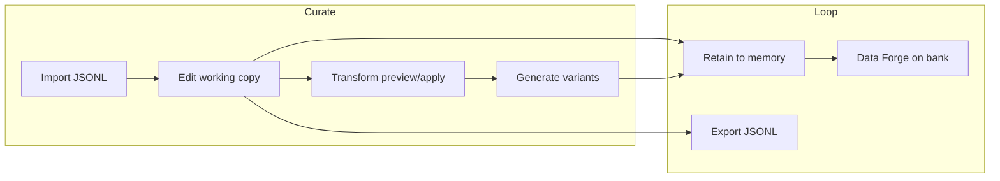

# Taste Studio

**Taste** is judgment you can ship — the difference between "technically correct" and "this is how we build here."

In the agent era, AI can draft code, pitches, and articles at scale. What remains scarce is **personal taste**: intuition earned by doing the same hard work for long enough that you feel what's good and bad before you can fully explain it. [Anurag Atulya's essay on that](/blog/taste) is the product *why*; this page is the *how*.

**Taste Studio** is Atulya's curation lane for that judgment. It sits beside [Data Forge](./data-forge.md):

| Lane | What it captures | How |
|------|------------------|-----|
| **Data Forge (pipeline)** | What the bank *believes* — citations, timelines, graph state | retain → consolidate → recipe → audit |
| **Taste Studio** | What *you* want the model to learn — tone, structure, patterns, corrections | import → edit → transform → variant → retain → export |

Pipeline forge purifies memory into auditable training records. Taste Studio preserves **human intent** as first-class training data.

---

## Why taste matters now

| Era | Bottleneck | What "good" looked like |
|-----|------------|-------------------------|
| Pre-LLM | Writing speed | Clean APIs, readable code, sensible boundaries |
| Early LLM | Prompt craft | Few-shot examples that didn't drift |
| **Now** | **Judgment at scale** | Curated examples, variant expansion, feedback loops that encode org taste |

Models absorb whatever you feed them. If your dataset is chat logs scraped from Slack, your fine-tune learns Slack — including the bad takes, the half-baked designs, and the code that shipped at 2am.

Taste Studio is where you:

- **Import** the examples you actually trust (golden paths, code review wins, design decisions you'd defend in a staff meeting)
- **Edit** working copies without losing the original seed
- **Transform** with preview (spellfix, tone shift) before anything hits export
- **Generate** variants from seeds — expand coverage without rewriting everything by hand
- **Retain** curated rows back into the bank — close the loop with tagged memories
- **Export** through the same ATR adapter stack as Data Forge

---

## When to use which lane

| Use case | Lane |
|----------|------|
| Memory-grounded Q&A with citation IDs | Data Forge (`temporal_qa`, `agent_trace`) |
| Consolidation pairs from live bank state | Data Forge |
| Hand-authored SFT chat examples | **Taste Studio** |
| Tone/style datasets (concise vs formal vs friendly) | **Taste Studio** |
| Rapid variant expansion before fine-tune | **Taste Studio** |
| "This eval failure is the correct answer" → seed for next train | **Taste Studio** (retain + re-export) |
| Compliance lineage from document ingest | Data Forge |
| Org-specific coding patterns and review standards | **Taste Studio** |

Many teams use **both**: Forge for what memory proves; Taste for what engineering culture demands.

---

## Core concepts

### Dataset

A named collection with a schema type:

| `schema_type` | Row shape | Typical use |
|---------------|-----------|-------------|
| `openai_chat` | `{ "messages": [{ "role", "content" }, ...] }` | SFT chat fine-tunes |
| `qa_pair` | `{ "question", "answer" }` | Instruction tuning, eval sets |
| `custom` | Any non-empty JSON object | Domain-specific structures |

Datasets carry `taste_tags` (e.g. `taste:studio`, `taste:code-review`) for filtering and retain metadata.

### Set (seed + working copy)

Each **set** is one training example:

| Field | Mutable? | Purpose |
|-------|----------|---------|
| `source_payload` | **No** (immutable seed) | What you imported or generated from — audit anchor |
| `working_payload` | **Yes** | What you edit, transform, and export |
| `set_key` | Set at import | Human-readable ID within the dataset |
| `variant_index` | System-assigned | `0` = seed; `1..N` = generated variants |
| `parent_set_id` | System-assigned | Lineage link for variants |
| `transform_log` | Append-only | History of applied transforms |
| `status` | Yes | `draft` → `ready` → `retained` → `archived` |
| `memory_unit_ids` | After retain | Links to bank memories |

**Revert** resets `working_payload` from `source_payload` — safe experimentation without losing the seed.

### Variant

A **variant** shares `set_key` with its seed but has `variant_index > 0` and `parent_set_id` pointing at the seed. Generate N similar rows from selected seeds (default 8, configurable) to expand coverage while preserving lineage.

### Transform

| Op | What it does | Params |
|----|--------------|--------|
| `spellfix_llm` | Fix spelling/grammar while preserving structure | — |
| `tone_shift` | Rewrite tone | `tone`: `concise` \| `formal` \| `friendly` |
| `raw` | Passthrough (chain plumbing) | — |

Always **preview** before apply when you care about diffs. Transforms log to `transform_log` on apply.

### Taste tags

Metadata on datasets and sets. On retain, the system auto-adds:

- `taste:dataset:{dataset_id}`
- `taste:set:{set_key}`

Use tags to filter recall, trace provenance, and build taste profiles (Phase 2).

---

## Operator flow



### Control plane

1. Open a bank → **Data Forge** → **Curate taste**
2. Create or select a dataset (schema type is fixed at creation)
3. Import JSONL — validated against the dataset schema before submit
4. Multi-select sets in the table; filter seeds vs variants
5. Toolbar: preview/apply transforms, tone shift, generate variants, send to memory, export
6. Inspector panel (half-width): **Working** / **Seed** / **Diff** / **Lineage** tabs

Async jobs (large transform or generate batches) queue as operations — poll via [Operations](./api/operations).

---

## API surface

Base path: `/v1/default/banks/{bank_id}/forge/taste/`

| Method | Path | Purpose |
|--------|------|---------|
| GET | `/catalog` | Schema types, transform ops, exporters |
| GET/POST | `/datasets` | List / create datasets |
| GET/PATCH/DELETE | `/datasets/{id}` | Dataset CRUD |
| GET/POST | `/datasets/{id}/sets` | List / import sets |
| GET/PATCH | `/sets/{id}` | Get / update set |
| POST | `/sets/{id}/revert` | Reset working from seed |
| POST | `/transform` | Preview or apply transform chain |
| POST | `/datasets/{id}/generate` | Generate N variants from seeds |
| POST | `/retain` | Send sets to `retain_batch` |
| POST | `/export` | Materialize → `openai_chat_jsonl` or `atr_jsonl` |

### Quick start (curl)

```bash
# Catalog
curl -s "$API/v1/default/banks/$BANK/forge/taste/catalog" | jq .

# Create dataset
curl -s -X POST "$API/v1/default/banks/$BANK/forge/taste/datasets" \
  -H "Content-Type: application/json" \
  -d '{"name":"code-review-taste","schema_type":"openai_chat","taste_tags":["taste:code-review"]}'

# Import one chat example
curl -s -X POST "$API/v1/default/banks/$BANK/forge/taste/datasets/$DATASET/sets" \
  -H "Content-Type: application/json" \
  -d '{"jsonl":"{\"messages\":[{\"role\":\"user\",\"content\":\"Review this handler\"},{\"role\":\"assistant\",\"content\":\"Extract validation to a pure function; keep the HTTP layer thin.\"}]}\n"}'

# Preview spellfix on all sets (omit set_ids) or subset
curl -s -X POST "$API/v1/default/banks/$BANK/forge/taste/transform" \
  -H "Content-Type: application/json" \
  -d '{"dataset_id":"'"$DATASET"'","preview":true,"ops":[{"op":"spellfix_llm"}]}'

# Apply tone shift
curl -s -X POST "$API/v1/default/banks/$BANK/forge/taste/transform" \
  -H "Content-Type: application/json" \
  -d '{"dataset_id":"'"$DATASET"'","ops":[{"op":"tone_shift","params":{"tone":"concise"}}]}'

# Generate 8 variants from seed sets
curl -s -X POST "$API/v1/default/banks/$BANK/forge/taste/datasets/$DATASET/generate" \
  -H "Content-Type: application/json" \
  -d '{"set_ids":["'"$SEED_SET_ID"'"],"count":8}'

# Retain selected sets into memory
curl -s -X POST "$API/v1/default/banks/$BANK/forge/taste/retain" \
  -H "Content-Type: application/json" \
  -d '{"set_ids":["'"$SET_ID"'"]}'

# Export
curl -s -X POST "$API/v1/default/banks/$BANK/forge/taste/export" \
  -H "Content-Type: application/json" \
  -d '{"dataset_id":"'"$DATASET"'","adapter_id":"openai_chat_jsonl"}' | jq -r .content
```

### Import formats

POST `/datasets/{id}/sets` accepts:

| Field | Format |
|-------|--------|
| `jsonl` | One JSON object per line |
| `sets` | Array of payload objects |
| `set_key_prefix` | Optional prefix for auto keys (`example-001`, …) |
| `taste_tags` | Tags applied to imported sets |

Validation is schema-aware: `openai_chat` requires non-empty `messages[]`; `qa_pair` requires `question` and `answer`.

### Transform scope

- **`set_ids` provided** — transform only those sets
- **`set_ids` omitted or empty** — transform **all sets** in the dataset

Large batches queue as async operations (same pattern as Data Forge jobs).

### Export adapters

Same exporter registry as Data Forge:

| Adapter | Output |
|---------|--------|
| `openai_chat_jsonl` | OpenAI fine-tune `messages[]` format |
| `atr_jsonl` | Full ATR archive rows |

Pass `set_ids` to export a subset; omit for the full dataset.

---

## Taste in practice: three patterns

### 1. Code review taste

Import golden review comments as `openai_chat` seeds. Generate variants for edge cases. Export for SFT. Retain the best rows so agents recall your standards in prod.

### 2. System design taste

`qa_pair` seeds: "Why did we choose event sourcing here?" with answers that reflect your actual tradeoffs. Tone-shift to formal for compliance docs, concise for internal runbooks.

### 3. Eval → taste loop

Model fails an eval. The correct answer becomes a seed in Taste Studio. Retain it. Re-export. Next fine-tune includes the fix as training signal — not a Slack screenshot.

---

## Closed loop (roadmap)

Phase 1 (shipped):

1. **Taste → memory** — one-click retain with taste tags
2. **Taste → export** — same ATR adapters as Data Forge
3. **Seed / working / diff / lineage** — full audit trail per example

Next:

| Step | Status |
|------|--------|
| Memory → forge with `taste_dataset` ingest | Planned |
| Eval failures → auto-import as seeds | Planned |
| Taste profile weights (bias generation toward org patterns) | Phase 2 |
| Forge + Taste unified versioning via memory repos | Roadmap |

See the [memory that trains itself](/blog/memory-that-trains-itself) post for the full loop narrative and `BRAIN.md` for product direction.

---

## Related

- [Data Forge](./data-forge.md) — pipeline forge, recipes, quality audit
- [Forge API](./api/forge) — shared forge job endpoints
- [Operations API](./api/operations) — poll async transform/generate jobs
- Blog: [Intuition is taste](/blog/taste) — Anurag Atulya on why judgment beats volume
- Blog: [Data Forge](/blog/data-forge) — provenance-first training from memory
