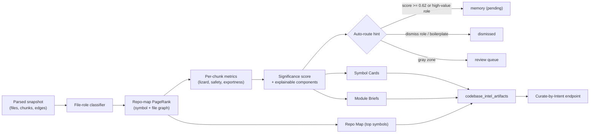
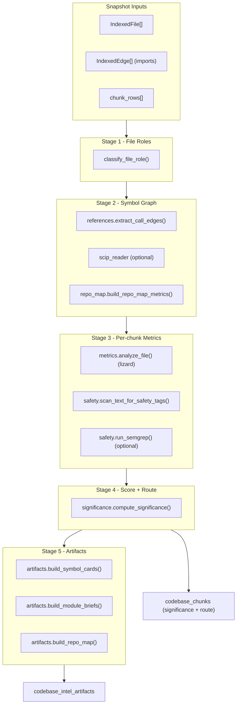
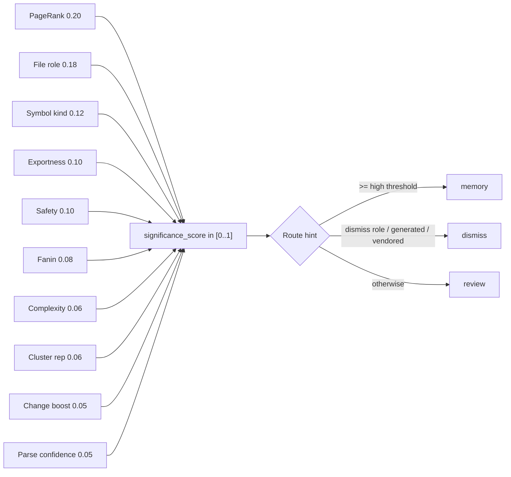
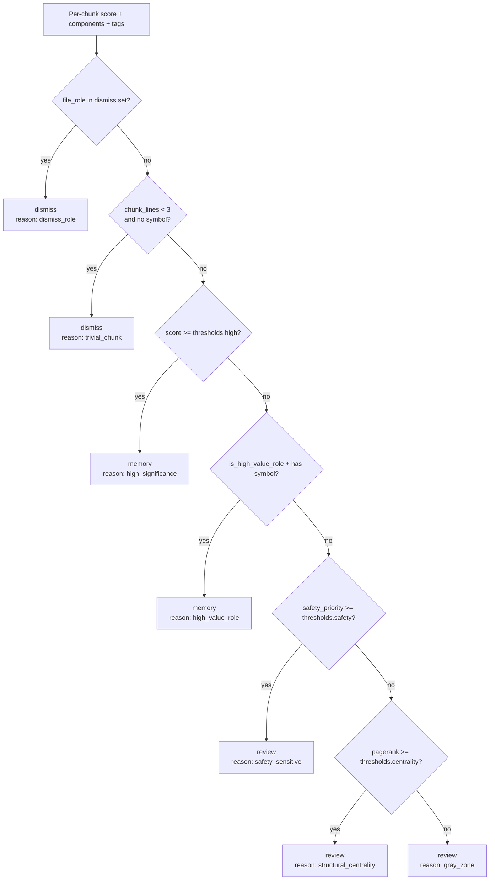
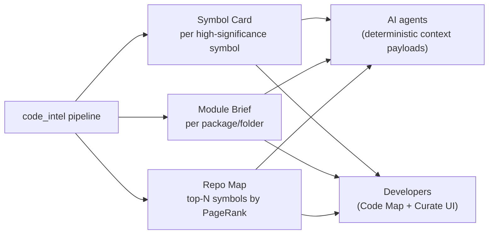
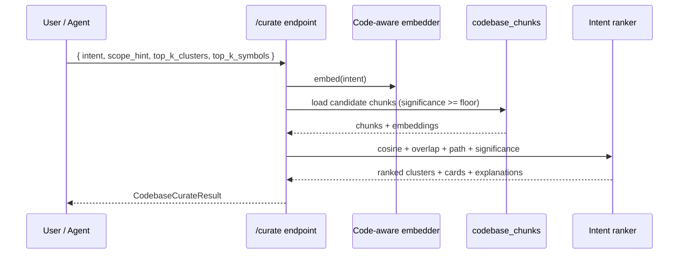
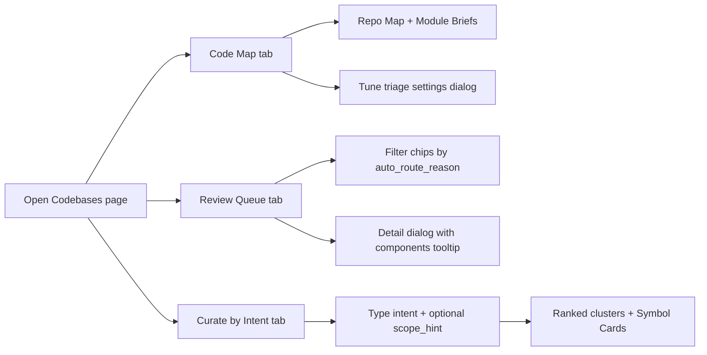

# Codebases Code Intelligence

  
Code Intelligence

  <h1 className="atulya-hero__title">Auto-triage, gold artifacts, and intent-driven curation</h1>
  

    Reviewing 50k+ chunks by hand is impossible. The Codebases code-intelligence
    pipeline turns every parsed snapshot into ranked, explainable, and routable
    knowledge: deterministic auto-triage, Symbol Cards, Module Briefs, a Repo Map,
    and an intent-driven curation surface that targets exactly what an agent or a
    human needs.
  

  

    <a className="button button--primary button--lg" href="/developer/codebases-lifecycle">
      See The Lifecycle
    </a>
    <a className="button button--secondary button--lg" href="/developer/codebases-api">
      Browse The API
    </a>
    <a className="button button--secondary button--lg" href="/developer/codebases-control-plane">
      Open The Control Plane
    </a>
  

<FeatureCardGrid
  cards={[
    {
      icon: '/img/icons/codebases-overview.svg',
      eyebrow: 'Pipeline',
      title: 'Mechanical signals, no LLM hot path',
      description:
        'File roles, PageRank centrality, complexity, safety tags, exportness, and clusters all combine into one explainable significance score per chunk.',
    },
    {
      icon: '/img/icons/codebases-lifecycle.svg',
      eyebrow: 'Auto-triage',
      title: 'Pre-route 90% of the queue',
      description:
        'Every chunk gets a deterministic dismiss / memory / review hint with a human-readable reason, so reviewers focus only on the gray zone.',
    },
    {
      icon: '/img/icons/codebases-control-plane.svg',
      eyebrow: 'Gold Artifacts',
      title: 'Symbol Cards, Module Briefs, Repo Map',
      description:
        'After triage we materialize three structured surfaces tuned for AI agents and developers, not opaque embeddings.',
    },
    {
      icon: '/img/icons/codebases-api.svg',
      eyebrow: 'Curate by Intent',
      title: 'Goal-shaped retrieval over the snapshot',
      description:
        'Type an intent, get a ranked cluster + symbol bundle that explains why each result matched. Built on code-aware embeddings.',
    },
  ]}
/>

## The Core Promise

If you only remember one thing, remember this:

- the **pipeline** scores every chunk with explainable signals
- **auto-triage** pre-routes the obvious 90% so humans only see the gray zone
- **gold artifacts** turn the snapshot into structured AI-grade knowledge
- **intent-driven curation** lets coders ask the snapshot for exactly what they need

## Why It Matters

| Pain in raw chunk review | What the code-intel pipeline does |
|---|---|
| 50k+ chunks make manual triage impractical | Deterministic auto-routing pre-classifies the obvious dismissals and obvious memory-grade chunks |
| `parse_confidence` only means "did the parser succeed" | `significance_score` means "is this chunk valuable for memory" |
| Reviewers cannot tell *why* a chunk matters | Every chunk exposes a `significance_components` breakdown and an `auto_route_reason` string |
| Embeddings alone do not explain the repo | Repo Map, Symbol Cards, Module Briefs surface structural understanding |
| Search is one-shot semantic similarity | Intent-driven curation re-ranks against the user's goal and includes path/text overlap explanations |

## Pipeline At A Glance

The pipeline runs once per parsed snapshot, alongside the existing ASD parse. It is pure-Python, deterministic, and degrades gracefully when optional dependencies are missing.

## Significance Score

Every chunk is scored in `[0..1]` from ten weighted components. The score is then compared against the codebase's `triage_settings` thresholds to produce a deterministic route hint.

### Component Weights

| Component | Weight | Signal source | What it captures |
|---|---|---|---|
| `pagerank_centrality` | **0.20** | Repo-map PageRank over the symbol graph | How structurally central the chunk's symbol is in the project |
| `role_weight` | **0.18** | `file_role.role_weight()` | Importance of the *file* the chunk lives in (entrypoint, api_route, etc.) |
| `symbol_kind_weight` | **0.12** | Chunk kind + lines | Functions and classes outrank import blocks and trivial code |
| `exportness` | **0.10** | Heuristic on text + symbol name + language | Whether the symbol is part of the public surface (`export`, public name) |
| `safety_priority` | **0.10** | `safety.scan_text_for_safety_tags()` | Auth, crypto, SQL, eval, deserialization, subprocess, network |
| `fanin` | **0.08** | Repo-map fan-in count | How many other places reference this symbol |
| `complexity_density` | **0.06** | `lizard` cyclomatic complexity / NLOC | Density of branching logic |
| `cluster_representativeness` | **0.06** | Embedding cluster centroid pick | Whether the chunk represents a near-duplicate group |
| `change_boost` | **0.05** | Diff against previous snapshot | New / modified files get a small lift |
| `parse_confidence` | **0.05** | Existing AST confidence | Tie-breaker only; no longer the headline number |

> **Total weight = 1.00.** The score is `min(1.0, weighted_sum)` so the only way to land near `1.0` is to dominate the high-weight components.

### Component Diagram

## File Roles

`classify_file_role()` is a pure path/name heuristic so it is fast, deterministic, and language-agnostic.

| FileRole | Examples | `role_weight` | Default route bias |
|---|---|---|---|
| `entrypoint` | `main.py`, `index.ts`, `app/main.go`, `cli.py` | 0.95 | memory |
| `api_route` | `routes/`, `controllers/`, `api/`, `*_handler.py` | 0.90 | memory |
| `public_lib` | `lib/`, `sdk/`, `pkg/`, public packages | 0.80 | memory |
| `schema_model` | `models/`, `schemas/`, `*.proto`, `*.graphql` | 0.75 | memory |
| `shared_util` | `utils/`, `helpers/`, `common/` | 0.65 | review |
| `config` | `*.yaml`, `*.toml`, `*.json` config | 0.55 | review |
| `migration` | `migrations/`, `alembic/` | 0.50 | review |
| `test` | `tests/`, `*_test.py`, `*.spec.ts` | 0.30 | review |
| `fixture` | `fixtures/`, `__snapshots__/` | 0.20 | review |
| `docs` | `*.md`, `docs/` | 0.20 | review |
| `boilerplate` | `__init__.py` (empty), `index.ts` re-exports | 0.05 | dismiss |
| `generated` | `_pb2.py`, `*.generated.*`, `dist/`, `build/` | 0.00 | dismiss |
| `vendored` | `node_modules/`, `vendor/`, `third_party/` | 0.00 | dismiss |
| `unknown` | Everything else | 0.40 | review |

## Auto-Triage Route Decision

### Route Reason Reference

| `auto_route_reason` | Meaning | Default `route_target` |
|---|---|---|
| `dismiss_role` | File is generated, vendored, fixture, or boilerplate | `dismissed` |
| `trivial_chunk` | Pure imports / tiny non-symbol fragment | `dismissed` |
| `high_significance` | Composite score crossed the high threshold | `memory` |
| `high_value_role` | Entrypoint / API route / public lib symbol | `memory` |
| `safety_sensitive` | Auth, crypto, SQL, deserialization etc. detected | `review` (not auto-memory by design) |
| `structural_centrality` | Symbol is highly connected but not high-scoring overall | `review` |
| `gray_zone` | Mid-significance, no other strong signal | `review` |

> Safety-tagged chunks never auto-promote to memory. They always land in `review` so a human can confirm intent.

## Triage Settings

`triage_settings` is a JSONB column on `codebases`. It can be edited from the **Code Map** tab via *Tune triage settings*. Defaults are tuned for production review loops.

| Setting | Default | Range | Effect |
|---|---|---|---|
| `score_threshold_high` | `0.62` | `[0..1]` | Lower → more chunks land in `memory`; raise to keep gold layer tighter |
| `centrality_threshold` | `0.35` | `[0..1]` | Lower → more pure-graph chunks pulled into `review` |
| `safety_threshold` | `0.25` | `[0..1]` | Lower → more aggressive safety tagging surfaces in review |
| `enable_safety_scan` | `true` | bool | Master switch for built-in safety regex scanner |
| `enable_semgrep` | `false` | bool | Opt-in Semgrep subprocess (heavier) |
| `semgrep_rulepack` | `null` | string | Semgrep ruleset slug or path |
| `embedding_provider` | `jina_local` | `jina_local` / `voyage_code_3` | Selects code-aware embedding backend for curation |
| `scip_index_path` | `null` | string | Path to a SCIP `index.scip` for precise xrefs |

## Gold Artifacts

After scoring runs, the pipeline materializes three artifact families into `codebase_intel_artifacts`. These are the AI-grade outputs.

### Symbol Card

A structured payload per high-significance symbol.

| Field | Description |
|---|---|
| `symbol_id` | FQ symbol name (`pkg.module.Class.method`) |
| `path`, `start_line`, `end_line` | Location in the snapshot |
| `kind` | `function` / `method` / `class` / `interface` / `type` |
| `signature` | Extracted signature line |
| `purpose` | One-line summary derived from docstring (`docstring_parser`) when available |
| `pagerank` | Normalized centrality |
| `fanin`, `fanout` | Caller and callee counts |
| `top_callers`, `top_callees` | Up to 5 connected symbol IDs |
| `complexity` | `lizard` cyclomatic complexity if available |
| `safety_tags` | List of safety tags from the body |
| `chunk_keys` | Linked chunk IDs for drill-down |

### Module Brief

A summary of a folder/package.

| Field | Description |
|---|---|
| `module_path` | Folder path (e.g. `atulya_api/engine/code_intel`) |
| `summary_role` | Dominant `FileRole` in the module |
| `public_surface` | Top exported symbols ranked by PageRank |
| `dependencies_in` | Modules that import from this one |
| `dependencies_out` | Modules this one imports from |
| `top_symbols` | Top-N symbols by composite significance |
| `chunk_count`, `loc` | Volume signals |

### Repo Map

A ranked symbol table inspired by Aider's RepoMap algorithm.

| Field | Description |
|---|---|
| `top_symbols[]` | Symbols sorted by `pagerank` desc |
| `total_symbols`, `total_files` | Snapshot footprint |
| `algorithm` | `"pagerank-aider"` or `"power-iteration-fallback"` |
| `generated_at` | UTC timestamp |

## Intent-Driven Curation

The `/curate` endpoint takes a free-form intent and returns ranked clusters + Symbol Cards. The ranker combines:

1. **Embedding similarity** between the intent and chunk embeddings (code-aware model)
2. **Token overlap** against chunk text and symbol names
3. **Path match** against the optional `scope_hint`
4. **Significance prior** so high-value symbols dominate ties

### Result Shape

| Field | Description |
|---|---|
| `total_candidates` | How many chunks the ranker evaluated |
| `clusters[]` | Top clusters with `cluster_id`, `representative_chunk`, `members`, `score`, `explain` |
| `symbol_cards[]` | Top Symbol Cards with `score` and `explain` |
| `explain` | Per-result string like `"text overlap on 'auth, login'; path match on 'api/'"` |

## Database Surface

A single Alembic migration adds the new columns and tables.

| Table / Column | Type | Purpose |
|---|---|---|
| `codebase_chunks.significance_score` | `double precision` | Final composite score (`[0..1]`) |
| `codebase_chunks.significance_components` | `jsonb` | Per-component breakdown for the *Why?* tooltip |
| `codebase_chunks.file_role` | `text` | One of the `FileRole` enum values |
| `codebase_chunks.auto_route_reason` | `text` | Human-readable reason for the route |
| `codebase_chunks.complexity_score` | `double precision` | `lizard` cyclomatic complexity |
| `codebase_chunks.safety_tags` | `text[]` | Safety tags from regex + Semgrep |
| `codebase_chunks.pagerank_centrality` | `double precision` | Per-symbol PageRank |
| `codebase_chunks.fanin_count` | `integer` | Inbound reference count |
| `codebases.triage_settings` | `jsonb` | Per-codebase tuning |
| `codebase_intel_artifacts` | new table | Stores Symbol Cards, Module Briefs, Repo Map |
| `codebase_auto_triage_overrides` | new table | Audit log of operator overrides on auto-routes |
| `codebase_saved_intents` | new table | Reusable intents per codebase |

## API Surface

All endpoints are namespaced under the existing codebase routes.

| Method | Path | Purpose |
|---|---|---|
| `GET` | `/banks/{bank_id}/codebases/{codebase_id}/chunks` | Now accepts `min_significance`, `max_significance`, `file_role`, `auto_route_reason`, `has_safety_tag`, `route_source`, `order_by` |
| `GET` | `/banks/{bank_id}/codebases/{codebase_id}/artifacts/repo-map` | Top symbols by PageRank |
| `GET` | `/banks/{bank_id}/codebases/{codebase_id}/artifacts/modules` | Module Briefs |
| `GET` | `/banks/{bank_id}/codebases/{codebase_id}/artifacts/symbols` | List Symbol Cards |
| `GET` | `/banks/{bank_id}/codebases/{codebase_id}/artifacts/symbols/{symbol_id:path}` | Single Symbol Card |
| `POST` | `/banks/{bank_id}/codebases/{codebase_id}/curate` | Intent-driven curation |
| `GET` | `/banks/{bank_id}/codebases/{codebase_id}/triage-settings` | Read current settings |
| `PUT` | `/banks/{bank_id}/codebases/{codebase_id}/triage-settings` | Update settings (applies on next index pass) |

### `chunks` query params (new)

| Parameter | Type | Notes |
|---|---|---|
| `min_significance` | `float` | Filter chunks below this score |
| `max_significance` | `float` | Cap, useful for surfacing the gray zone |
| `file_role` | `string` | One of the `FileRole` values |
| `auto_route_reason` | `string` | Filter by route reason |
| `has_safety_tag` | `string` | e.g. `auth`, `crypto`, `sql_string` |
| `route_source` | `string` | `auto`, `user`, or `none` |
| `order_by` | `string` | `significance` (default), `pagerank`, `complexity`, `path`, `review` |

## Control Plane Surface

The Codebases page now exposes two new tabs and a richer review queue.

| Surface | What it shows | When to use |
|---|---|---|
| **Review Queue** (existing, enhanced) | Significance score, file role, route source chip, safety tag chips, *Why?* tooltip with components, route reason filter chips, second filter row (role / route source / safety / order / min significance) | Daily triage, focusing only on the gray zone |
| **Code Map** (new) | Repo Map top symbols, Module Briefs, *Tune triage settings* dialog | Onboarding to a new repo, planning refactors |
| **Curate by Intent** (new) | Intent input, scope hint, ranked clusters and Symbol Cards with per-result explanations | Feature work, bug investigation, "where do I start" questions |

## Optional Dependencies

The pipeline ships with sensible defaults but supports lazy-loaded upgrades.

| Capability | Default | Upgrade | When to enable |
|---|---|---|---|
| Code embeddings | `jina-embeddings-v2-base-code` (local) | `voyage-code-3` (paid API) | When higher recall on intent curation justifies the spend |
| Safety scanning | Built-in regex pattern set | `semgrep` subprocess | When you want CI-grade rules on memory-bound chunks |
| Cross-references | `tree-sitter` heuristic edges | `scip-protobuf` reading `index.scip` | When you have an SCIP indexer in CI for the repo's languages |
| Complexity | `lizard` (default, multi-language) | n/a | Always on |
| Graph centrality | `networkx` PageRank | Pure-Python power-iteration fallback | Auto-fallback if `networkx` unavailable |

## Recommended Operating Pattern

1. **Index** the repo (ZIP or GitHub).
2. Open the **Code Map** tab to learn the shape of the codebase before triaging.
3. (Optional) Open *Tune triage settings* to bias more or less aggressively for your team.
4. Switch to **Review Queue** and filter by `auto_route_reason = gray_zone` first.
5. Spot-check a few `safety_sensitive` and `structural_centrality` items.
6. Use **Curate by Intent** before starting any feature ("auth refresh flow", "where is rate limiting handled") to pull a focused bundle.
7. Approve via `Retain Pipeline` for high-value Symbol Cards and `ASD Direct` for bulk memory hydration.

## Why The Pipeline Stays Fast

| Choice | Effect |
|---|---|
| All scoring is pure-Python with no LLM in the hot path | Indexing cost stays bounded by the number of chunks, not tokens |
| Heavy optional deps are lazy-loaded | A repo without Semgrep / SCIP / Voyage still gets the full default experience |
| Embeddings cached by content hash | Re-indexing a snapshot reuses prior work for unchanged chunks |
| `lizard` results cached per file content hash | Repeated parses of the same content are free |
| Repo-map PageRank uses `networkx` with a pure-Python fallback | Works in environments without `networkx` installed |

## What This Is Not

- It is **not** an LLM-powered summarizer. Symbol Card `purpose` lines come from extracted docstrings only; no model generates them at index time.
- It is **not** a replacement for `recall` or `reflect`. Curate-by-intent is scoped to the *current snapshot*; recall and reflect still operate over the *approved* memory bank.
- It is **not** a substitute for human review on safety-tagged chunks. Auto-routing intentionally defers those to the review queue.

That's the contract: deterministic mechanics first, structured artifacts second, human approval last.
