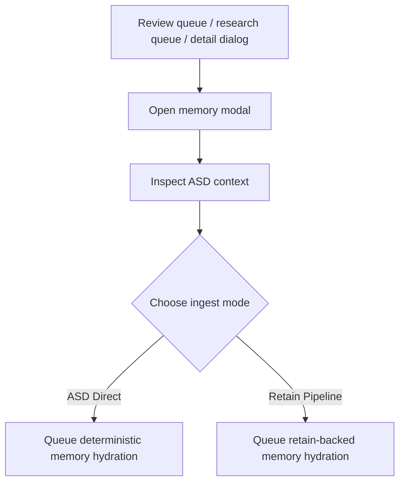

# Codebases Control Plane

  
Operator UX

  <h1 className="atulya-hero__title">A workbench for developers, not just operators</h1>
  

    The Control Plane `Codebases` experience is built to match how engineers really inspect a
    repository: import it, look at the structure, compare it against the approved state, then
    choose when to publish into memory.
  

<FeatureCardGrid
  cards={[
    {
      icon: '/img/icons/codebases-overview.svg',
      eyebrow: 'Selected Repo',
      title: 'Current and approved snapshot in one place',
      description:
        'Developers can see whether they are looking at a fresh parsed snapshot or the last approved memory-backed one.',
    },
    {
      icon: '/img/icons/codebases-control-plane.svg',
      eyebrow: 'Workbench',
      title: 'Review queue, repo map, symbol search, impact',
      description:
        'The structural tools are usable before approval so review is meaningful instead of blind, and the chunk queue stays progressively loaded for large repos.',
    },
    {
      icon: '/img/icons/codebases-lifecycle.svg',
      eyebrow: 'Review Flow',
      title: 'Approve only when ready',
      description:
        'The UI keeps approval explicit, which prevents silent memory growth from unreviewed imports or refreshes.',
    },
  ]}
/>

## What The Page Is Optimized For

The page is built around five developer questions:

1. what repo snapshot am I looking at
2. what changed
3. which semantic chunks matter enough for memory
4. what symbols and files matter
5. should this snapshot become the memory-backed source of truth

## The Main Areas

### Import

Developers can import from:

- ZIP archive
- public GitHub repo and ref

The import area is designed to make the source choice obvious instead of burying it behind generic file-ingestion UX.

### Selected Codebase Panel

This panel shows:

- parse status
- memory approval status
- current snapshot ID
- approved snapshot ID
- source ref or commit
- indexed file counts

That combination matters because teams often need to compare the newest parsed state against the currently approved memory state.

### Review Action

The key action is:

- `Approve Memory Import`

This should be read as:

- "publish this parsed snapshot into Atulya memory"

not:

- "finish importing the repo"

That distinction helps developers trust what the button actually does.

The important nuance in the updated UI is that approval no longer means "hydrate everything."

It means:

- apply the chunks already routed to memory
- keep research-routed chunks staged but out of memory
- preserve clean review state for anything still unrouted

### Workbench Tabs

The workbench is split into:

- `Review Queue`
- `Repo Map`
- `Symbol Search`
- `Impact`
- `Research Queue`
- `Approved Memory`

Those tabs map well to how developers think during code review and refactor planning:

- triage the important chunks
- browse the shape
- search the name
- trace the blast radius
- stage deeper follow-up without polluting memory
- inspect what is already backing `recall` and `reflect`

## Memory Action Modal

The memory action is no longer a blind queue button.

When a developer sends a chunk to memory, the UI now opens a modal that shows:

- the ASD chunk preview
- symbol and cluster context
- parse confidence
- the ingest choice between `ASD Direct` and `Retain Pipeline`

| UI choice | What a developer is saying |
|---|---|
| `ASD Direct` | "Store the reviewed code exactly and keep the operation cheap." |
| `Retain Pipeline` | "Use the richer memory ingest path because this chunk deserves stronger semantic linking." |

## Approved Memory Tab

The `Approved Memory` tab answers a question teams ask constantly:

- what code is actually backing shared memory right now

That tab shows:

- approved snapshot ID
- approved source ref or commit
- approved chunk cards
- document IDs
- chunk detail drill-down

This matters because the newest parsed snapshot and the currently approved memory snapshot are often not the same thing.

## Before Approval Versus After Approval

| State | What the developer sees |
|---|---|
| Before approval | Parsed snapshot is visible, chunk routes are editable, and `document_id` stays empty |
| During review | The queue can send chunks to memory, research, dismissed, or back to unrouted |
| After approval | Stable chunk-backed codebase documents exist and memory-backed flows can rely on the applied snapshot |

## Why The UX Is Structured This Way

| UX choice | Why it exists |
|---|---|
| Progressive loading | Large repos should not freeze the workbench |
| Dialog-based detail inspection | Keep the main list clean while still supporting deep review |
| Explicit memory modal | Make the speed-versus-richness tradeoff honest |
| Approved memory history | Let teams see what is powering agent memory today |

This is one of the most important UX details: the page is useful even before approval, so review becomes a real workflow rather than a ceremonial click.

## Why This Matters

Many repo tools collapse import, parse, and publish into one opaque operation.

Atulya deliberately does not.

The Control Plane keeps those phases separate because engineering teams care about:

- deterministic structural understanding
- token efficiency
- auditability
- avoiding silent changes to shared reasoning state

That is why the `Codebases` page should feel closer to a developer workbench than a generic admin form.
