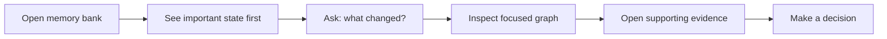
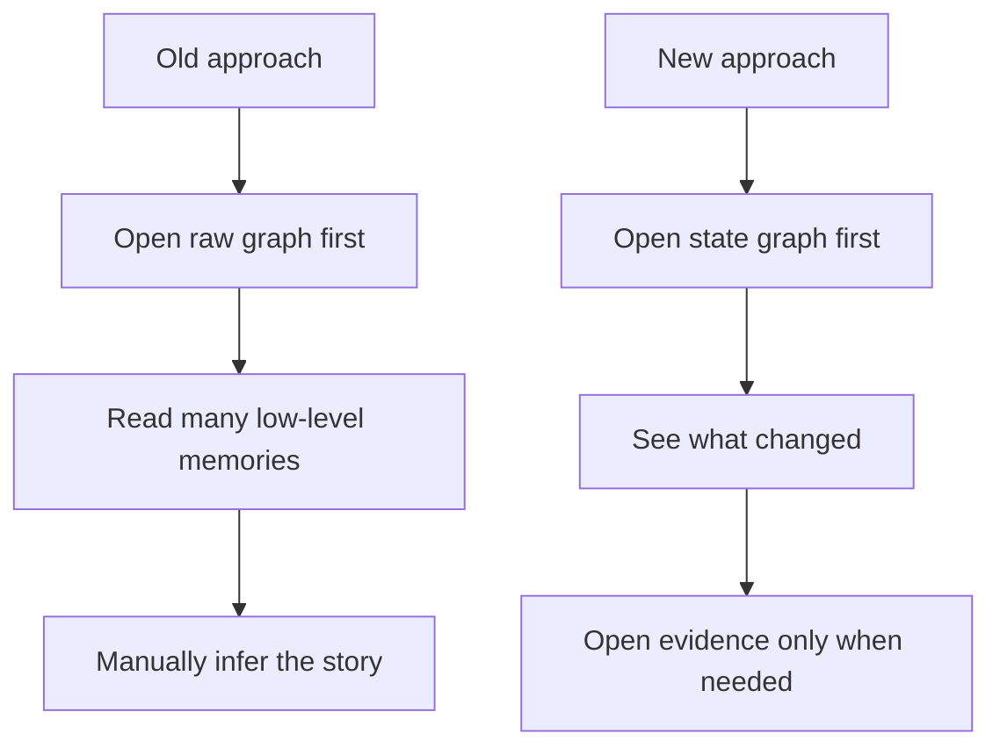
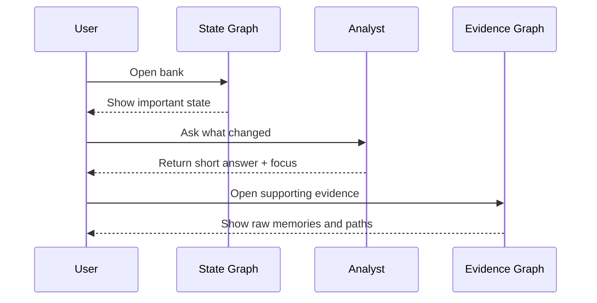
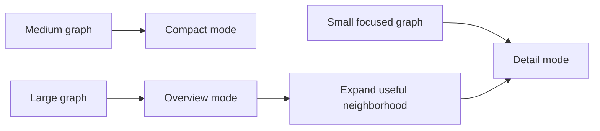
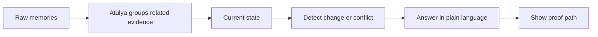

# Control Plane Graph Intelligence

Atulya's Control Plane now helps teams understand a memory bank as a living system, not just a list of stored items.

The main question this feature answers is simple:

**What changed, why does Atulya think that, and what should I inspect next?**

This is useful for support teams, ops teams, knowledge teams, and anyone who needs to review evolving memory without manually tracing every raw fact.

## What You Get

Graph Intelligence adds two connected views:

- **State Graph** shows the current state of important entities and topics.
- **Evidence Graph** shows the raw memories and links behind that state.

Together, they let a human move from:

1. a high-level summary
2. to a focused graph
3. to the exact evidence behind it

## The Fast Mental Model

If you only remember one thing, remember this:

- **State Graph** tells you the story.
- **Evidence Graph** shows you the proof.
- **The analyst** helps you move between the two without getting lost.

| If you want to... | Start here | Why |
|---|---|---|
| Understand what changed | **State Graph** | It starts with meaning, not noise |
| Check whether something is still true | **State Graph** | It highlights changed, stale, and conflicting state |
| Verify the raw source | **Evidence Graph** | It shows the actual memories and links |
| Explain a conclusion to another person | **Analyst answer + Evidence Graph** | You get the short answer and the supporting path |

## Why This Replaces the Old Graph

The older raw node-link graph was useful for debugging, but primitive for real operational use.

It forced humans to read a dense network of low-level memories and infer the story themselves.

The new model is more useful because it starts with meaning:

- show important state instead of every raw memory first
- highlight changes, contradictions, and stale assumptions
- explain why Atulya believes something
- let the user drill into proof only when needed

The raw graph still exists, but it is now a supporting investigation tool instead of the default landing view.

## The Two Main Views

### State Graph

Use **State Graph** when you want to understand the bank quickly.

It emphasizes:

- what changed recently
- which entities or topics matter most
- where evidence conflicts
- which states may be stale

Each card is designed to be readable in plain language, with confidence, evidence count, and a short explanation of the current state.

Typical questions:

- What changed about this customer, repo, or workflow?
- Which belief is now outdated?
- Where do we have conflicting evidence?

| State Graph helps with... | What the user sees |
|---|---|
| Recent change | A state card and change signal |
| Contradiction | Evidence that does not agree |
| Stale understanding | A belief that has not been refreshed while related signals moved |
| Priority | The most important entities or topics first |

### Evidence Graph

Use **Evidence Graph** when you need proof.

It shows the underlying memories, connections, and supporting paths behind a state or answer.

Typical questions:

- Which raw memories support this conclusion?
- Which document or chunk introduced this belief?
- How are these two memories connected?

| Evidence Graph helps with... | What the user sees |
|---|---|
| Raw proof | Memory cards and their links |
| Provenance | Which memory, chunk, or document supports a conclusion |
| Connection tracing | How one memory led to another |
| Human review | The exact path behind a state or analyst answer |

## A Simple Human Workflow

The intended flow is:

1. Open a memory bank.
2. Start in **State Graph** to see the important changes.
3. Ask the graph analyst a question such as `What changed about X?`
4. Inspect the answer and the focused subgraph.
5. Open **Evidence Graph** when you want the raw proof.

This keeps the experience text-first and human-readable, while still giving full traceability.

| Step | What Atulya is doing for the human |
|---|---|
| Open bank | Surfaces the most useful state first |
| Ask a question | Narrows the graph to the relevant part |
| Inspect answer | Explains what changed in plain language |
| Open evidence | Lets you verify the proof without losing context |

## Built for Large Banks

Graph Intelligence is designed to scale without turning the browser into a wall of cards.

For larger banks, the Control Plane uses progressive exploration instead of trying to render everything at once.

### Detail Mode

For smaller focused neighborhoods, Atulya shows full cards and rich interaction.

### Compact Mode

For medium-sized neighborhoods, cards become lighter and more condensed.

### Overview Mode

For larger graphs, Atulya switches to an overview that summarizes the bank using:

- clusters
- bundled paths
- top-use memories
- top-use chunks
- focused neighborhood expansion

This is important because the goal is not "show every node." The goal is "help a human understand the bank quickly."

| Graph size | What Atulya does | Why it helps |
|---|---|---|
| Small | Shows rich cards directly | Full detail is still easy to read |
| Medium | Uses lighter cards | Keeps the canvas readable |
| Large | Starts with an overview | Avoids turning the browser into a wall of boxes |
| Very large | Expands only the useful neighborhood | Keeps the experience fast and understandable |

## What the Analyst Layer Adds

The graph is not just a visual renderer.

Atulya also builds a read model that lifts raw memory evidence into higher-level state:

- stable state
- changed state
- contradictory state
- stale state

The analyst flow then returns:

- a short answer
- the focused nodes and edges
- change events
- an evidence path
- recommended checks

That is what makes the feature useful in industry: the graph is connected to explanation, not just drawing.

| Analyst output | What it means in plain language |
|---|---|
| `answer` | The short human-readable conclusion |
| `focal_node_ids` / `focal_edge_ids` | Which part of the graph matters for this question |
| `change_events` | What changed, conflicted, or went stale |
| `evidence_path` | The proof trail behind the answer |
| `recommended_checks` | What a human may want to review next |

## API Surfaces Behind the UI

The Control Plane is backed by dedicated graph endpoints:

- `GET /v1/default/banks/{bank_id}/graph/intelligence`
- `POST /v1/default/banks/{bank_id}/graph/investigate`
- `GET /v1/default/banks/{bank_id}/graph/summary`
- `GET /v1/default/banks/{bank_id}/graph/neighborhood`

The first two power the meaning-first workflow:

- build the state graph
- investigate a change or question

The second two support scaling:

- summarize large graphs
- expand a focused neighborhood without loading the whole bank into the canvas

| Endpoint | What it is for |
|---|---|
| `GET /graph/intelligence` | Build the meaning-first state graph |
| `POST /graph/investigate` | Ask a question and get a focused answer |
| `GET /graph/summary` | Summarize a large graph into a readable overview |
| `GET /graph/neighborhood` | Load the part of the graph a human actually needs |

## Good Use Cases

This feature is especially useful when a memory bank represents:

- customer history
- product operations
- support cases
- engineering incidents
- personal knowledge that evolves over time
- shared team memory across tools and conversations

In each of these cases, a human usually does not want a primitive raw graph first.

They want:

- the story
- the proof
- the next thing to check

| Real use case | Why Graph Intelligence helps |
|---|---|
| Support operations | See what changed about a customer or incident before reading every note |
| Product operations | Track shifts in issues, requests, and state over time |
| Engineering incidents | Move from a summary of change to the exact evidence trail |
| Shared team memory | Understand evolving knowledge without reading every raw memory |
| Personal knowledge banks | Review how beliefs and facts changed over time |

## Related Docs

- [Services](./services)
- [Installation](./installation#control-plane)
- [Configuration](./configuration#control-plane)
- [Brain and Dream](./brain-and-dream)
